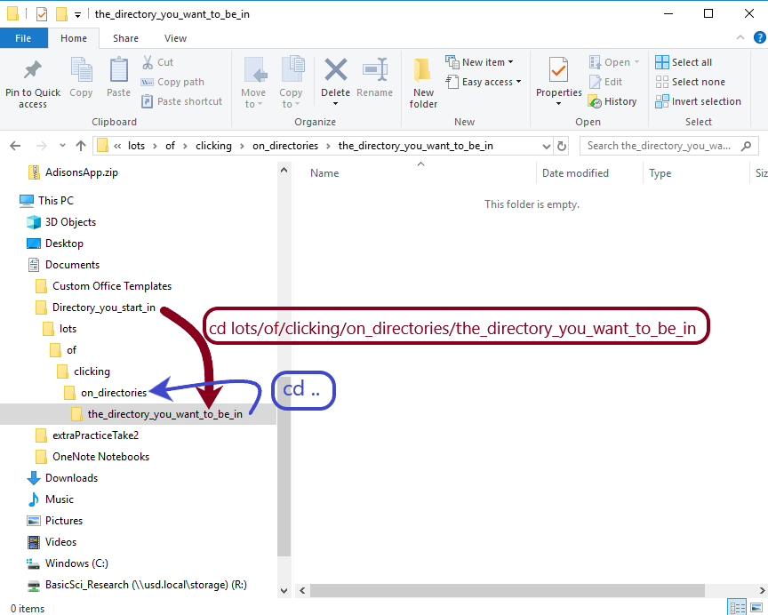

# Command Line Basics

<table>
  <thead>
    <tr>
      <th style="text-align:left"><em>Command</em>
      </th>
      <th style="text-align:left"><em>Description</em>
      </th>
    </tr>
  </thead>
  <tbody>
    <tr>
      <td style="text-align:left">pwd</td>
      <td style="text-align:left">print working directory (current location)</td>
    </tr>
    <tr>
      <td style="text-align:left">ls</td>
      <td style="text-align:left">list directories &amp; files in current directory</td>
    </tr>
    <tr>
      <td style="text-align:left">cd ..</td>
      <td style="text-align:left">back up one directory</td>
    </tr>
    <tr>
      <td style="text-align:left">cd</td>
      <td style="text-align:left">back up to the home directory</td>
    </tr>
    <tr>
      <td style="text-align:left">cd myDirectory/</td>
      <td style="text-align:left">open myDirectory</td>
    </tr>
    <tr>
      <td style="text-align:left">mkdir exp1</td>
      <td style="text-align:left">makes a directory-exp1</td>
    </tr>
    <tr>
      <td style="text-align:left">nano file1</td>
      <td style="text-align:left">opens file1 in nano editor</td>
    </tr>
    <tr>
      <td style="text-align:left">cp file1 /home/User.name/exp2</td>
      <td style="text-align:left">
        <p>copies file to exp2 (current location must be</p>
        <p>the original location of file1)</p>
      </td>
    </tr>
    <tr>
      <td style="text-align:left">mv file1 /home/User.name/exp2</td>
      <td style="text-align:left">
        <p>copies file to exp2 (current location must be</p>
        <p>the original location of file1)</p>
      </td>
    </tr>
    <tr>
      <td style="text-align:left">mv file1 ./exp1 ./exp2</td>
      <td style="text-align:left">
        <p>moves file1 from exp1 to exp2 (exp1 &amp; exp2</p>
        <p>are both in the current directory (denoted by period (.))</p>
      </td>
    </tr>
    <tr>
      <td style="text-align:left">rm file1</td>
      <td style="text-align:left">removes file1 from current directory</td>
    </tr>
    <tr>
      <td style="text-align:left">whoami</td>
      <td style="text-align:left">returns username</td>
    </tr>
    <tr>
      <td style="text-align:left">echo Hello World</td>
      <td style="text-align:left">
        <p>prints Hello World</p>
        <p>to the terminal</p>
      </td>
    </tr>
  </tbody>
</table>

## Command Line Basics \(with examples\)

### Navigating Directories

First, we will use the pwd \(print working directory\) command to show our current location.

```text
[Joseph.Madison@login-0-0 ~]$ pwd
/home/Joseph.Madison
```

We can also list the files in out current working directory.

```text
[Joseph.Madison@login-0-0 ~]$ ls
demo_files  dissertation_research  install_files
```

To move to the demo\_files sub-directory, we can use the cd \(change directory\) command. We can follow this up with the pwd command to verify we have moved to the demo\_files sub-directory.

```text
[Joseph.Madison@login-0-0 ~]$ cd demo_files
[Joseph.Madison@login-0-0 demo_files]$ pwd
/home/Joseph.Madison/demo_files
```

We can also move backward in our directory line using the cd .. command. Here we will move from the demo\_files back to the Joseph.Madison directory.

```text
[Joseph.Madison@login-0-0 demo_files]$ cd ..
[Joseph.Madison@login-0-0 ~]$ pwd
/home/Joseph.Madison
```

Next, we will make two new directories in the Joseph.Madison directory. We can do this using the mkdir command. We will call our directories exp1 and exp2. Verifying that the two new directories were created can be done by using ls.

```text
[Joseph.Madison@login-0-0 ~]$ mkdir exp1
[Joseph.Madison@login-0-0 ~]$ mkdir exp2
[Joseph.Madison@login-0-0 ~]$ ls
demo_files  dissertation_research  exp1  exp2  install_files
```

Next, we will make a text file in the exp1 directory. We first have to cd into the exp1 directory. It is again good practice to verify your location with pwd.

```text
[Joseph.Madison@login-0-0 ~]$ cd exp1
[Joseph.Madison@login-0-0 exp1]$ pwd
/home/Joseph.Madison/exp1
```

### Making Files

Next, we will create a file using a text editor. Here we will use nano \(there are others including emacs and vi, but nano is simple\). We use the nano command followed by the name of what we want to call the new file. \(Include a file extension if desired.\)

```text
[Joseph.Madison@login-0-0 exp1]$ nano file1
```

Once you press enter you will be moved into the text editor. A cursor at the top of the page is where text will be entered as you type. This is a powerful tool with many applications but here I will type 'Hello World!'

```text
GNU nano 1.3.12             File: file1                       Modified  

Hello World!
```

I will then use ctrl-X to exit. This will give me a prompt for saving changes.

```text
    Save modified buffer (ANSWERING "No" WILL DESTROY CHANGES) ?              
     Y Yes
     N No           ^C Cancel
```

Type y for yes. You will then be prompted to verify the file name, hit enter or change the original name and hit enter.

```text
File Name to Write:file1
```

You will then be brought back to the directory you put the file in. You can verify your location with pwd.

```text
[Joseph.Madison@login-0-0 exp1]$
[Joseph.Madison@login-0-0 exp1]$ pwd
/home/Joseph.Madison/exp1
```

### Moving/Removing Files

You can also move the file you just made with the mv command. Here, I will move file1 from the exp1 directory to the exp2 directory. I will also change directories to the exp2 directory and verify my file was moved. Note: You must specify the entirety of the directory you are moving to, otherwise your file will just be renamed \(mv can double over as a rename command\).

```text
[Joseph.Madison@login-0-0 exp1]$ mv file1 /home/Joseph.Madison/exp2
[Joseph.Madison@login-0-0 exp1]$ cd ..
[Joseph.Madison@login-0-0 ~]$ cd exp2
[Joseph.Madison@login-0-0 exp2]$ ls
file1
```

If you want to copy a file instead of moving it, you can use the cp command in the same manner.

```text
[Joseph.Madison@login-0-0 exp1]$ cp file1 /home/Joseph.Madison/exp2
[Joseph.Madison@login-0-0 exp1]$ ls
file1
[Joseph.Madison@login-0-0 exp1]$ cd ..
[Joseph.Madison@login-0-0 ~]$ cd exp2
[Joseph.Madison@login-0-0 exp2]$ ls
file1
```

The file is now in both locations.

Another command that is very useful and very dangerous is the remove command rm.

> The HPC does not backup files so if you remove a file or directory it is gone \(always have backup files elsewhere such as on your local PC!\) Here I will remove file1 from exp2. You can ls and nothing should be there \(you will be sent back to the command prompt.

```text
[Joseph.Madison@login-0-0 exp2]$ rm file1
[Joseph.Madison@login-0-0 exp2]$ ls
[Joseph.Madison@login-0-0 exp2]$
```

Directories can also be removed using the rm -r command. This command will also delete any files contained in the directory. You first have to move the parent directory. After deleting you can verify it is no longer there using ls.

```text
[Joseph.Madison@login-0-0 exp2]$ cd ..
[Joseph.Madison@login-0-0 ~]$ pwd       
/home/Joseph.Madison
[Joseph.Madison@login-0-0 ~]$ rm -r exp2
[Joseph.Madison@login-0-0 ~]$ ls
demo_files  dissertation_research  exp1  install_files
```

### Misc.

Another useful command is the whoami command. This command will tell you what user you are on the system \(and is also a nice sanity check late at night\)

```text
[Joseph.Madison@login-0-0 ~]$ whoami
Joseph.Madison
```

The last subject of discussion in this doc will be the echo command. The echo command can serve many functions such as calling shell and environment variable values. Here it is demonstrated by simply repeating what we enter.

```text
[Joseph.Madison@login-0-0 ~]$ echo HPC is fun!
HPC is fun!
```


