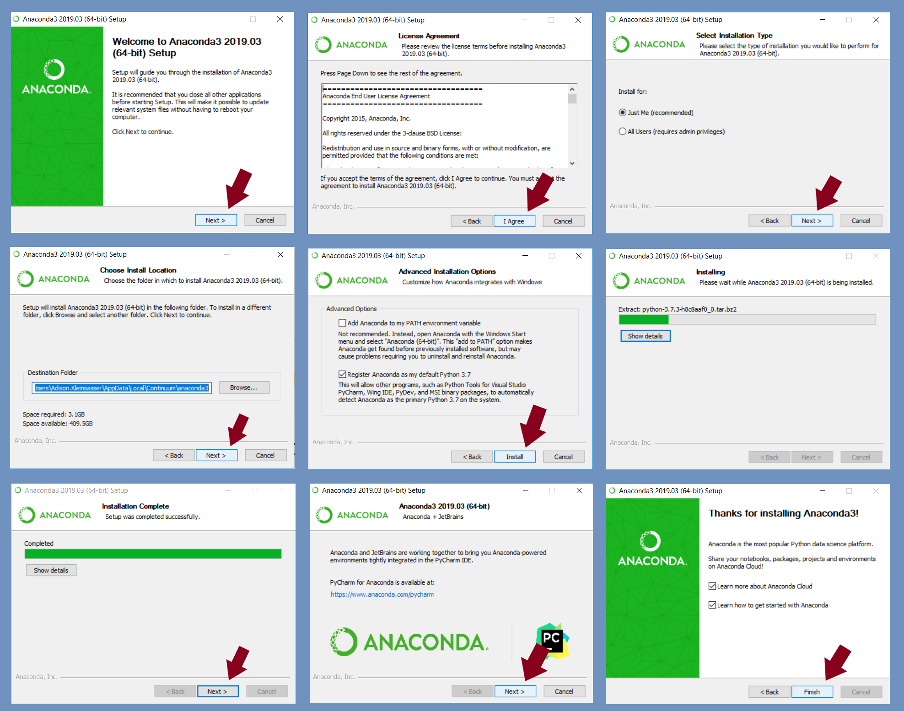
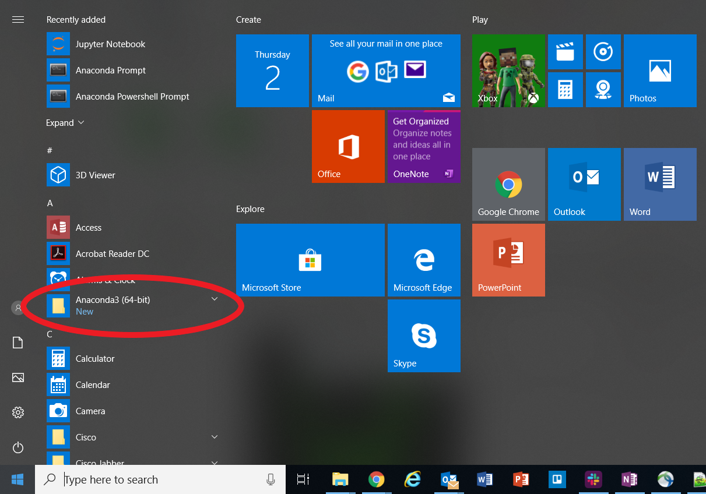
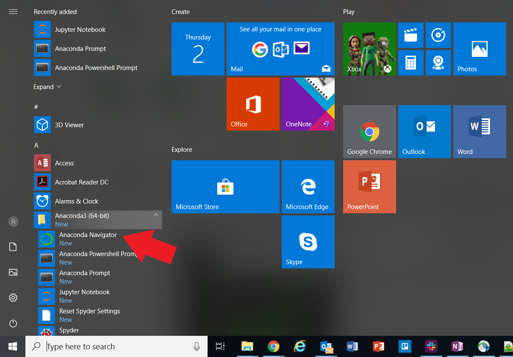
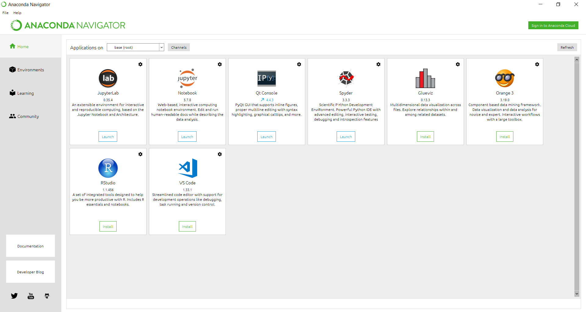
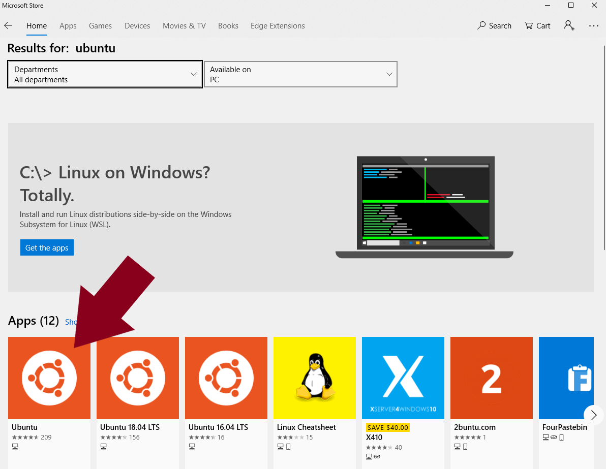
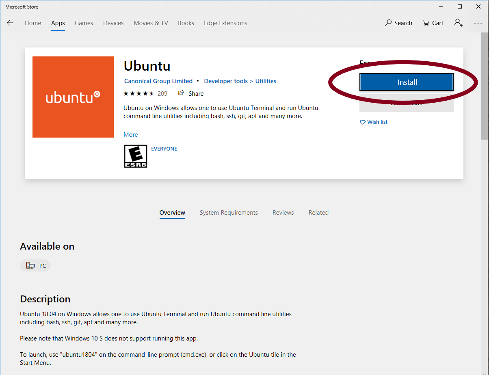
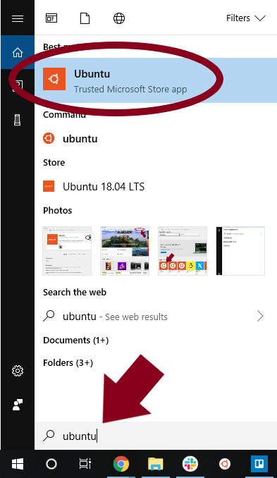
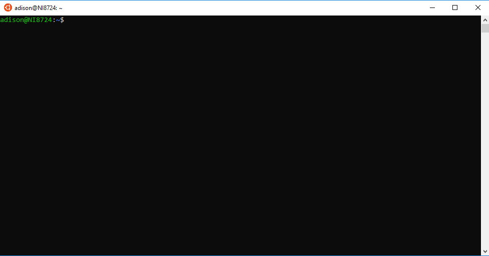

# o


Warning: this site is under construction.  The information may be incomplete.


## Anaconda on Windows

To download Anaconda, go to the distribution website: [https://www.anaconda.com/distribution/](https://www.anaconda.com/distribution/).

Scroll down to the download section.  Select "Windows", then select "Download".

Follow the installation wizard.

The Users Guide should pop up \([this](http://docs.anaconda.com/anaconda/user-guide/getting-started/#open-nav-win) webpage\).

To open Anaconda, go to the start menu and expand the Anaconda3 folder.

Select "Anaconda Navigator".

## Bioconda on Windows

## Anaconda on Ubuntu on Windows

### Installing Ubuntu on Windows

Ubuntu for Windows can be downloaded from the Microsoft store.  

Search for "ubuntu".

Select the app.

Click "**Get**", then "**Install**".

Search for "Ubuntu" and select the app.

The window will look like this:

### Installing Anaconda on Ubuntu on Windows

