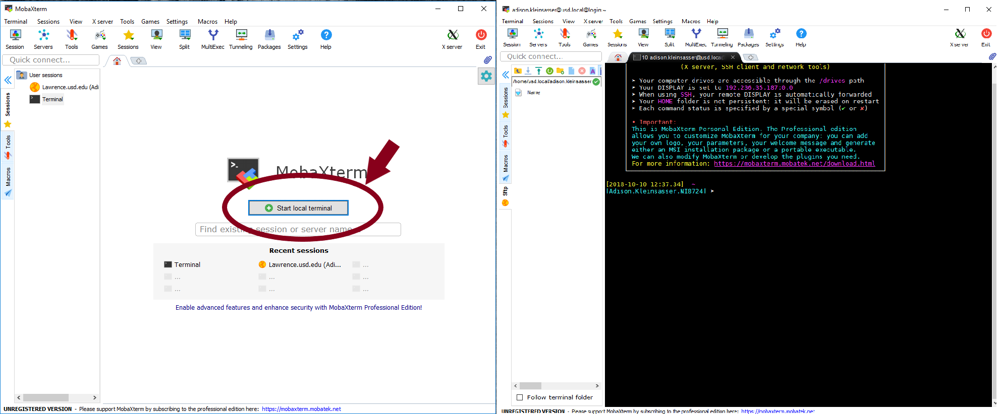
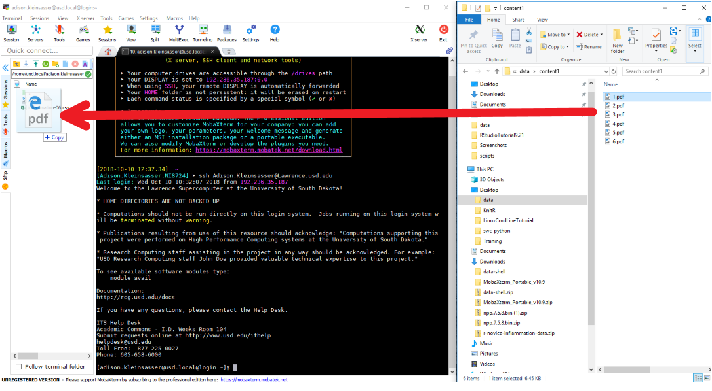
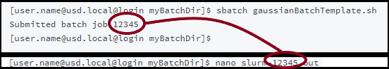

# Gaussian Tutorial

## Command Line Basics

| _Command_ | _Description_ |
| :--- | :--- |
| ls | list directories & files in current directory |
| mkdir newDir | makes a new directory in the current directory |
| cd .. | back up one directory |
| cd myDirectory/ | open myDirectory |
| nano file1 | opens file1 in nano editor |
|        Ctrl-o  ,  Enter |      In nano-saves edits  |
|        Ctrl-X |      Exits out of nano |


The "cd" command is used to move into and out of directories \(folders\).  It's basically equivalent \(in Windows Explorer\) to clicking on a subfolder of the folder you are in \(eg. "cd subfolder/"\)  or hitting the back arrow to move out of a folder into the previous one \(eg. "cd .."\).  



## Getting Started

#### MobaXterm

MobaXterm can be freely downloaded here \(use the Home Installer Edition\): [https://mobaxterm.mobatek.net/download.html](https://mobaxterm.mobatek.net/download.html)


Open MobaX.



Log in to Lawrence \(refer to the following code\).

```text
[user.name@ ~]$ ssh User.Name@Lawrence.usd.edu
Warning: Permanently added 'lawrence.usd.edu' (RSA) to the list of known hosts.
User.Name@Lawrence.usd.edu's password:
Last login: Wed Jan  9 13:14:19 2019 from 192.236.35.187
Welcome to the Lawrence Supercomputer at the University of South Dakota!
......

[user.name@usd.local@login ~]$
```

## Transferring Files \(Lawrence to & from PC\)

In MobaX, the file explorer/hierarchy is visible just to the left of the command line interface. Navigate into directories by clicking on them, and out of directories using the "parent directory" button.


Note: entering/exiting a directory in this area doesn't change your current directory in the command line \(you'll still be in the same directory as before in the command line\).  Use the cd command to navigate directories in the command line.



From this section of the MobaX window, you can drag and drop files between Lawrence and your PC as needed.




Once your files are in the proper directories, they can be handled in the same way as the example input files are handled in this tutorial \(excluding the steps of copying the example input files into their respective directories\).

## Interactive Jobs

Open MobaX and **log into Lawrence** \(see section "Getting Started"\).  

Make a directory in your home directory, and navigate into it:

```text
[user.name@usd.local@login ~]$ mkdir myInteractiveDir
[user.name@usd.local@login ~]$ cd myInteractiveDir/
[user.name@usd.local@login myInteractiveDir]$
```

Connect to a node.

```text
[user.name@usd.local@login myInteractiveDir]$ srun --pty bash
[user.name@usd.local@node56 myInteractiveDir]$
```

Copy the Gaussian test file into your myInteractiveDir directory.

```text
[user.name@usd.local@node56 myInteractiveDir]$ cp /opt/examples/Gaussian/test.com ./test.com
[user.name@usd.local@node56 myInteractiveDir]$ ls
test.com
```


If these commands don't make sense, go to the top section: "Command Line Basics".


To see the Gaussian modules available:

```text
[user.name@usd.local@node56 myInteractiveDir]$ module avail gauss
---------------------------- /act/modulefiles -------------------------------- 
gaussian/09 gaussian/16
```

Load one of the Gaussian modules.

```text
[user.name@usd.local@node56 myInteractiveDir]$ module load gaussian/16
[user.name@usd.local@node56 myInteractiveDir]$ module list
Currently Loaded Modulefiles:
  1) gaussian/16
```

Run Gaussian with an input file:

```text
[user.name@usd.local@node56 myInteractiveDir]$ g16 <test.com >interactiveOutput.com
[user.name@usd.local@node56 myInteractiveDir]$
```

To view the output, open "interactiveOutput.com" with nano or another editor.

```text
[user.name@usd.local@node56 myInteractiveDir]$ nano interactiveOutput.com
```


To get back out of nano, use the instructions at the bottom of the command line screen, or see "Command Line Basics".


Navigate out of "myInteractiveDir" into your home directory:

```text
[user.name@usd.local@node56 myInteractiveDir]$ cd ..
[user.name@usd.local@node56 ~]$ 
```

Exit the node.

```text
[user.name@usd.local@node56 ~]$ exit
[user.name@usd.local@login ~]$ 
```

## Batch Jobs

If entering the tutorial at this point, open MobaX and log into Lawrence \(see the second half of "Getting Started"\).

Make a directory in your home directory, and navigate into it:

```text
[user.name@usd.local@login ~]$ mkdir myBatchDir
[user.name@usd.local@login ~]$ cd myBatchDir
[user.name@usd.local@login myBatchDir]$
```


If these commands don't make sense, go to the top section: "Command Line Basics".


Copy the Gaussian batch job template files into your myBatchDir directory.

```text
[user.name@usd.local@login myBatchDir]$ cp -r /opt/examples/Gaussian/. ./
[user.name@usd.local@login myBatchDir]$ ls
gaussianBatchTemplate.sh  output.txt  test.com
```

Open the file "gaussianBatchTemplate.sh" using nano \(or another editor, if you prefer\) and note the features described in the image below.

```text
[user.name@usd.local@login myBatchDir]$ nano gaussianBatchTemplate.sh
```

Open the file "test.com" \(you will have to exit viewing gaussianBatchTemplate.sh in nano to do this in the same terminal\).

```text
[user.name@usd.local@login myBatchDir]$ nano test.com
```

In the last line, "**test.com**" is the **input** file name and the slurm ID followed by ".out" is the **output** file name.  Also note that the number of CPUs \(**ntasks**\) requested **matches** the **%nprocshared** \(or **%nprocs**\) in the input file.



--ntasks in batch file should equal %nprocshared in input file


Exit nano \(Ctrl-x\), then run the batch job:

```text
[user.name@usd.local@login myBatchDir]$ sbatch gaussianBatchTemplate.sh
Submitted batch job 12345
[user.name@usd.local@login myBatchDir]$ 
```

Show the list of jobs running on Lawrence:

```text
[user.name@usd.local@login myBatchDir]$ squeue
             JOBID PARTITION     NAME     USER ST       TIME  NODES NODELIST(REASON)
             12345     nodes gaussian     user2 R       0:22      1 node40
             48469     nodes     bash     user1 R       3:04      1 node56
             48467     nodes     bash     user3 R      23:07      5 node[25-29]
             48458     nodes     bash     user4 R      23:41      1 node21
             48459     nodes     bash     user4 R      23:41      1 node22
             48460     nodes     bash     user4 R      23:41      1 node24
             48457     nodes     bash     user4 R      25:14      1 node11
             48449     nodes     bash     user4 R      25:18      1 node13
             48450     nodes     bash     user4 R      25:18      1 node17

```

Show only your jobs:

```text
[user.name@usd.local@login myBatchDir]$ squeue -u user.name
             JOBID PARTITION     NAME     USER ST       TIME  NODES NODELIST(REASON)
             12345     nodes gaussian   user.n  R    2:34:52      1 node43
```

When your job is complete, it will not appear on squeue.  To see the output of your job when completed, open the ".out" file.

```text
[user.name@usd.local@login myBatchDir]$ nano 12345.out
```

To see how the job went, and look at any errors, open the slurm file.

```text
[user.name@usd.local@login myBatchDir]$ nano slurm-12345.out
```


Note: the number 12345 in slurm-12345.out corresponds to the number of the batch job above.




## Graphical User Interface Jobs

If entering the tutorial at this point, open MobaX and log into Lawrence \(for help, see the section "Getting Started"\).

### **Starting the GUI**

Log into a node

```text
[user.name@usd.local@login ~]$ srun --pty bash 
[user.name@usd.local@node51 ~]$ 
```

Load the Gaussian module:

```text
[user.name@usd.local@node51 ~]$ module load gaussian/16 
[user.name@usd.local@node51 ~]$ module list
Currently Loaded Modulefiles:  
1) gaussian/16
```

Launch the Gaussian GUI:

```
[user.name@usd.local@node51 ~]$ srun gview
```

The GUI will open:


