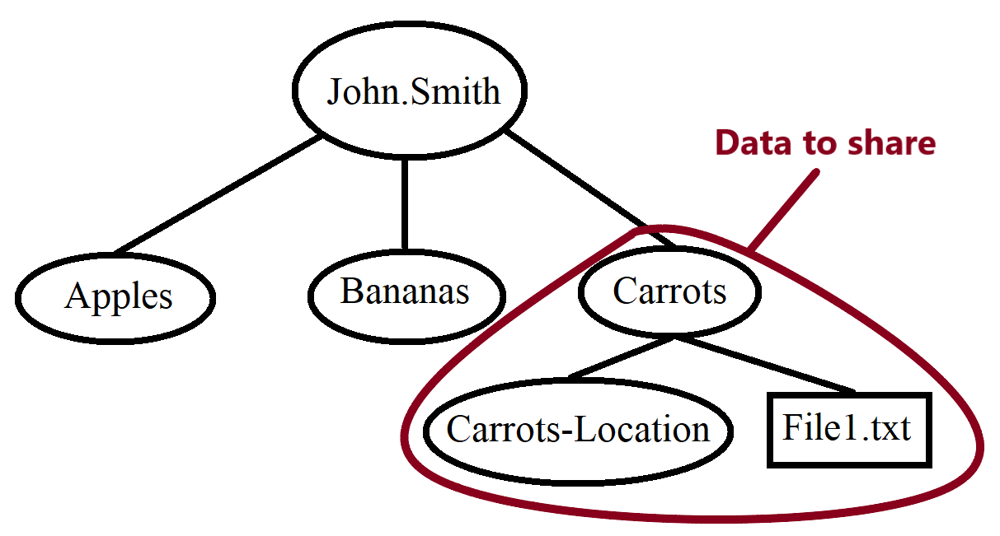

# Globus Information


This page is under construction, and may have incomplete or missing information.  Hardhats are not required.


## Availability

Connecting to SDDS Globus \(data on Lawrence\) through Globus is **only available** to send/receive data to/from **USD users** at this time. If you are not from USD but working with someone who is, and wish to share data via Globus, please contact rcg@usd.edu, and ask them to create a Globus collection with the data to be shared and then share that new collection with your Globus user. If you are from USD, and would like to share files with a non-USD user, please see the section Sharing with Other Users under the Adding Lawrence \(Home and Lab Directories\) section.

## Adding a Collection

### Meta Information


### Choosing a Base Path

The base path of a collection is the location to which the collection connects.  

For example, a base path:

```text
lawrence/home/usd.local/jane.smith
```

would lead to Jane Smith's home directory, if Jane Smith's home directory was located at "/home/usd.local/jane.smith" on Lawrence.


Note: the path to a home directory may be different.  To find the path to your home directory, log in to Lawrence, and use the command

pwd

to show the path to your home directory, then put "lawrence" in front of it.


Keep in mind that the base path shows the highest point in the file system of the destination computer that the Globus connection can reach. For example, a researcher using a collection with this base path:

```text
lawrence/home/usd.local/jane.smith/folder2
```

will only be able to reach items in "folder2", not in the rest of Jane Smith's home directory.

### Common base paths

Common options for collection base paths include:

* Individual home directories \(on Lawrence\)
* Lab directories \(on Lawrence\)
* SDDS lab

## Guest Collections & Sub-Collections

In regard to data on Lawrence, Guest collections allow a user to share data from locations on Lawrence that would normally be inaccessible to other users \(e.g. a home directory, or a lab group directory if the guest is not a member of the lab group\).  Permissions on a guest collection can be set at read only \(the guest can view, but not edit, the data\), or read & write \(the guest can view and edit data\).  

Sub-collections limit access to a particular directory and the sub-directories within it.  For example: John Smith has a home directory that contains three sub-directories: 'Apples', 'Bananas', and 'Carrots'.  Within the 'Carrots' sub-directory are files and a directory named 'Carrots-Location'.  



John wants to share the 'Carrots' sub-directory, its files and the 'Carrots-Location' directory with a colleague, but not the 'Apples' or 'Bananas' directories.  To do this, he can make a sub-collection for the 'Carrots' directory.

For instructions on making a guest collection or sub-collection, please see the page [Globus Tutorials: Sharing with Other Users](https://usdrcg.gitbook.io/docs/lawrence-hpc/globus-tutorials#sharing-with-other-users).

## User Groups


