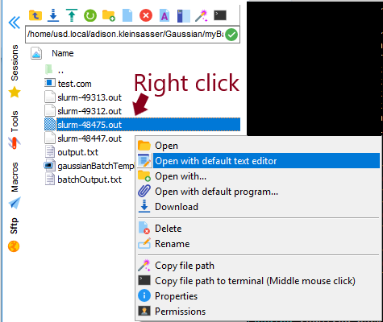
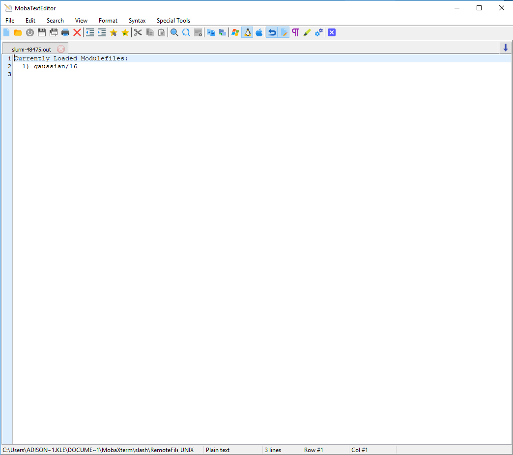

# Helpful Hints

## MobaX

MobaX comes with a File Explorer-like window that is useful for viewing directories and files in a point-and-click interface.

It also allows the user to open files from this window in an editor.

## Slurm

