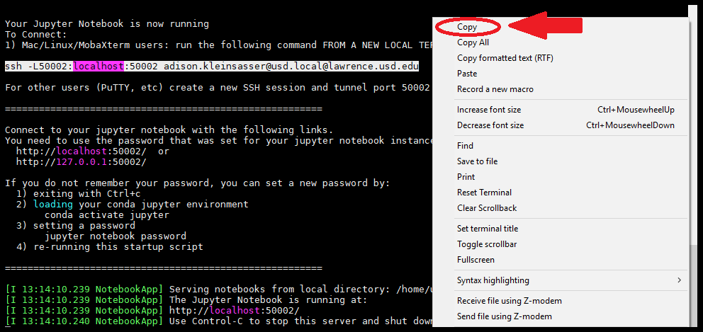
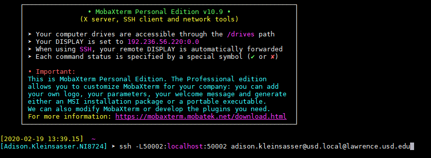

# Jupyter on Lawrence

## Installing Jupyter


Note: the instructions for installing Jupyter are currently under construction - proceed at your own risk.


Make a directory for Jupyter scripts and cd into it.

```bash
user.name@node02 ~]$ mkdir jupyterScripts
user.name@node02 ~]$ cd jupyterScripts
user.name@node02 jupyterScripts]$
```

Copy the installation and starting scripts into your directory.

```bash
user.name@node02 jupyterScripts]$ cp /home/jennewein_lab/shared/bill/jupyter/* ./
user.name@node02 jupyterScripts]$ ls
install-jupyter-notebook.sh  start-jupyter-notebook.sh  test-ipyparallel.py
user.name@node02 jupyterScripts]$ 
```

Run the install script.

```bash
user.name@node02 jupyterScripts]$ bash install-jupyter-notebook.sh
Creating new environment now...
Collecting package metadata (repodata.json): done
Solving environment: done

## Package Plan ##

  environment location: /home/usd.local/adison.kleinsasser/anaconda3/envs/jupyter

  added / updated specs:
    - ipykernel
    - jupyter


The following packages will be downloaded:

    package                    |            build
    ---------------------------|-----------------
    bleach-3.1.1               |             py_0         111 KB  conda-forge
    gst-plugins-base-1.14.5    |       h0935bb2_2         6.8 MB  conda-forge

```

Follow any instructions that pop up.


### Set your Password

Once Jupyter is installed, you will need to set a password.


## Starting Jupyter

Make sure you are in a node **other than the login node**.  If you are not, request a node:

```bash
user.name@login ~]$ srun --pty bash
user.name@node02 ~]$
```

Navigate to the directory that contains start-jupyter-notebook.sh and run the file using bash

```
user.name@node02 jupyter]$ bash start-jupyter-notebook.sh
```

This will print an ssh command to the terminal:


```bash
========================================================

Your Jupyter Notebook is now running
To Connect:
1) Mac/Linux/MobaXterm users: run the following command FROM A NEW LOCAL TERMINAL WINDOW (not this one)

ssh -L50002:localhost:50002 adison.kleinsasser@usd.local@lawrence.usd.edu

For other users (PuTTY, etc) create a new SSH session and tunnel port 50002 to localhost:50002

========================================================

Connect to your jupyter notebook with the following links.
You need to use the password that was set for your jupyter notebook instance.
  http://localhost:50002/  or
  http://127.0.0.1:50002/

```



If you are starting Jupyter for the **first time**, you will need to **set a password**. Please see the "Set Your Password" section under "Installing Jupyter"


### Open Jupyter

Copy the ssh command from the print-out. \(**Do not use Ctrl-C**, it'll cut off the job\).



Open a second terminal, and paste the command into it.



Then hit "Enter".


Back in the first terminal, copy the http address:


Then open a browser, and paste it in the address bar


Press "Enter", and Jupyter will come up.


