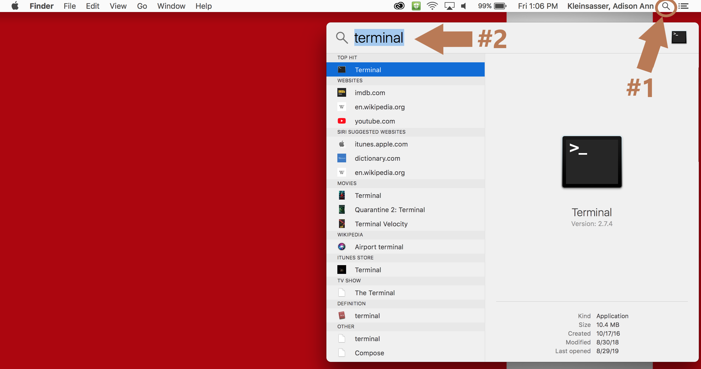
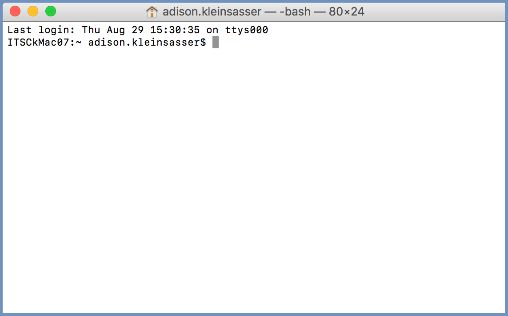

# Login


**Permission** from the HPC administrator is needed to access Lawrence. Please email the ServiceDesk (servicedesk@usd.edu) to request an account, and **CC** the Research Computing Group (rcg@usd.edu).



* **USD users:** Lawrence login information will be based on your USD login (e.g. your password will be the same as for your email account)
* **Non-USD users**: receive an email from the ServiceDesk regarding login information and/or password creation after the account is set up. &#x20;
* **All users:** As a security feature, three incorrect logins will result in your account being temporarily locked out of Lawrence (not USD in general) until the lockout expires or an administrator overrides it.

For assistance or to ask questions, please contact the ServiceDesk (servicedesk@usd.edu). Make sure to include the job id of your initial account request.


.png>)

The Lawrence Supercomputer: Lawrence is composed of a many nodes. The user logs into the login node from their computer. From there they can access many other nodes in order to run analyses. The GPU node is used for graphics processing, and computations involving matrices. The high-memory (himem) node contains increased RAM for jobs that require high memory. The VIZ node is used for making visualizations. Besides the special purpose nodes, Lawrence contains 85 regular computational nodes for data analysis. The data storage nodes act like a harddrive, albeit much faster, storing the files that are on the user's (or lab's) account. **Caution:** the storage nodes are not backed up - so be sure to back up your files somewhere off of Lawrence (external hdd, the cloud, department pc's). The management node is utilized for managing the system and not available to regular users.

## Lawrence SSH Login for Mac

### Install XQuartz


If using a **USD issued computer**, you may need **administrative permissions**. Please contact the ServiceDesk for assistance if these permissions prevent installation of the software. Make sure to include details like the software name.

**Example:** "I have recently been provisioned an account on Lawrence, and I am following the tutorial instructions found at the RCG docs site ([https://usdrcg.gitbook.io/docs/lawrence-hpc/login#lawrence-ssh-login-for-mac](https://usdrcg.gitbook.io/docs/lawrence-hpc/login#lawrence-ssh-login-for-mac)) to download XQuartz. My computer is USD issued, and requires administrative permissions to install the software. Because I don't have this level of access, I would like help in installing this software."


To begin, first download the XQuartz installer [here](https://www.xquartz.org).


Go to your downloads and open the installer.


Run the installer. (If using a USD computer, an administrative username/password may be needed for this step.)


### Log into Lawrence

Search for the terminal in the Finder window



It will start with a command prompt (a line that ends with "$").



Next, login to Lawrence via an ssh session through the login node. The output you see will be different depending on how your Duo account is setup and if you use SSH Keys. Using SSH Keys will bypass the password and Duo requirements while continuing to use a password will require a second authentication through Duo. This first example is if your account uses 'Push Notification' for your Duo secondary authentication.

```
ITSCkMac07:~ user.name$ ssh User.Name@lawrence.usd.edu
Keyboard-interactive authentication prompts from server:
| Password:
| Duo two-factor login for user.name@usd.edu
|
| Enter a passcode or select one of the following options:
|
|  1. Duo Push to XXX-XXX-####
|
| Passcode or option (1-1): 1
| Success. Logging you in...
End of keyboard-interactive prompts from server
```

This second example is if your account uses a Token for your Duo secondary authentication.

```
ITSCkMac07:~ user.name$ ssh User.Name@lawrence.usd.edu
Password: 
Duo two-factor login for user.name@usd.edu

Enter a passcode or select one of the following options:

Passcode: ######
```


Note: your **password** will **not show up** as you type and it may look like nothing is happening. It may seem strange, but keep typing, the remote system is still picking up your keystrokes and when you hit enter your password will be checked. However, the **passcode** you type in from your Duo token **will show up** as you type, this is normal.

If you mistype your password, the system won't check to see you mistyped it until you complete your Duo authentication at which point it will say `Success. Logging you in...` but then ask you for your password again. Make sure to correctly type your password this time, and complete the Duo authentication again to log in.


If it accepts the password and your second Duo authentication method, it will show a welcome message and a prompt (a line that ends with '$').

```
Last login: (date and address here)
### Other information.... ###
###                       ###
###                       ###
[user.name@usd.local@login ~]$
```


If **libgl errors** appear when running a GUI (e.g. rstudio), then before running the software, try exporting this environmental variable:

```
[user.name@usd.local@login ~]$ export LIBGL_ALWAYS_INDIRECT=1
```


All logins go to the login node by default. **Do not** run compute jobs on the login node! Please read further instructions on how to use Slurm, the Lawrence cluster workload manager. See the picture below for a graphical representation of how the login nodes relate to the rest of Lawrence.

 (1) (1).png>)

## Lawrence SSH Login for Linux

Open the command terminal, and ssh into Lawrence. The output you see will be different depending on how your Duo account is setup and if you use SSH Keys. Using SSH Keys will bypass the password and Duo requirements while continuing to use a password will require a second authentication through Duo. This first example is if your account uses 'Push Notification' for your Duo secondary authentication.

```
username@NI8724:~$ ssh User.Name@Lawrence.usd.edu
Keyboard-interactive authentication prompts from server:
| Password:
| Duo two-factor login for user.name@usd.edu
|
| Enter a passcode or select one of the following options:
|
|  1. Duo Push to XXX-XXX-####
|
| Passcode or option (1-1): 1
| Success. Logging you in...
End of keyboard-interactive prompts from server
```

This second example is if your account uses a Token for your Duo secondary authentication.

```
username@NI8724:~$ ssh User.Name@Lawrence.usd.edu
Password: 
Duo two-factor login for user.name@usd.edu

Enter a passcode or select one of the following options:

Passcode: ######
```


Note: your **password** will **not show up** as you type and it may look like nothing is happening. It may seem strange, but keep typing, the remote system is still picking up your keystrokes and when you hit enter your password will be checked. However, the **passcode** you type in from your Duo token **will show up** as you type, this is normal.

If you mistype your password, the system won't check to see you mistyped it until you complete your Duo authentication at which point it will say `Success. Logging you in...` but then ask you for your password again. Make sure to correctly type your password this time, and complete the Duo authentication again to log in.


If it accepts the password and your second Duo authentication method, it will show a welcome message and a prompt (a line that ends with '$').

```
Last login: Tue Aug 20 16:03:26 2019 from 192.236.54.40
Welcome to the Lawrence Supercomputer at the University of South Dakota!
### Other information.... ###
###                       ###
###                       ###
(base) [user.name@usd.local@login ~]$
```

All logins go to the login node by default. **Do not** run compute jobs on the login node! Please read further instructions on how to use Slurm, the Lawrence cluster workload manager. See the picture below for a graphical representation of how the login nodes relate to the rest of Lawrence.

.png>)

## Lawrence SSH Login for Windows

For video instructions on how to download MobaXterm, click [here](https://usd.hosted.panopto.com/Panopto/Pages/Sessions/List.aspx#folderID=%2243cfe1c4-9acf-4571-add7-aad40134cb34%22).

### Downloading MobaXterm (MobaX) terminal

Utilization of the Lawrence cluster by Windows users requires the use of the MobaXterm terminal. MobaXterm can be freely downloaded here (use the Home Installer Edition):

[https://mobaxterm.mobatek.net/download.html](https://mobaxterm.mobatek.net/download.html)

 (1).png>)


If using a **USD issued computer**, you may need **administrative permissions**. Please contact the ServiceDesk for assistance if these permissions prevent installation of the software. Make sure to include details like the software name.

**Example**: "I have recently been provisioned an account on Lawrence, and I am following the tutorial instructions found at the RCG docs site ([https://usdrcg.gitbook.io/docs/lawrence-hpc/login#lawrence-ssh-login-for-mac](https://usdrcg.gitbook.io/docs/lawrence-hpc/login#lawrence-ssh-login-for-mac)) to download XQuartz. My computer is USD issued, and requires administrative permissions to install the software. Because I don't have this level of access, I would like help in installing this software."


Once downloaded, open the MobaX terminal. Click "Start local terminal".

.png>)

The command line prompt will appear:


### Logging into Lawrence

You can then ssh onto the Lawrence cluster (same command as Linux/Mac).

The output you see will be different depending on how your Duo account is setup and if you use SSH Keys. Using SSH Keys will bypass the password and Duo requirements while continuing to use a password will require a second authentication through Duo. This first example is if your account uses 'Push Notification' for your Duo secondary authentication.

```
[2018-11-19 10:55.23]  ~
[User.Name.NI11018] ➤ ssh User.Name@lawrence.usd.edu
Keyboard-interactive authentication prompts from server:
| Password:
| Duo two-factor login for user.name@usd.edu
|
| Enter a passcode or select one of the following options:
|
|  1. Duo Push to XXX-XXX-####
|
| Passcode or option (1-1): 1
| Success. Logging you in...
End of keyboard-interactive prompts from server
```

This second example is if your account uses a Token for your Duo secondary authentication.

```
[2018-11-19 10:55.23]  ~
[User.Name.NI11018] ➤ ssh User.Name@lawrence.usd.edu
Password: 
Duo two-factor login for user.name@usd.edu

Enter a passcode or select one of the following options:

Passcode: ######
```


Note: your **password** will **not show up** as you type and it may look like nothing is happening. It may seem strange, but keep typing, the remote system is still picking up your keystrokes and when you hit enter your password will be checked. However, the **passcode** you type in from your Duo token **will show up** as you type, this is normal.

If you mistype your password, the system won't check to see you mistyped it until you complete your Duo authentication at which point it will say `Success. Logging you in...` but then ask you for your password again. Make sure to correctly type your password this time, and complete the Duo authentication again to log in.


If it accepts the password and your second Duo authentication method, it will show a welcome message and a prompt (a line that ends with '$').

```
Last login: Mon Dec 25 19:37:34 2017 from ni11018.usd.local
### Other information.... ###
###                       ###
###                       ###
[user.name@usd.local@login ~]$
```

All logins go to the login node by default. **Do not** run compute jobs on the login node! Please read further instructions on how to use Slurm, the Lawrence cluster workload manager. See the picture below for a graphical representation of how the login nodes relate to the rest of Lawrence.

 (1).png>)

## Generating and using SSH Keys

SSH Keys are a way to securely connect to Lawrence over SSH that doesn't require your USD password. SSH Keys have come as a pair and have a public and private half. The public key part will be installed Lawrence using your password and Duo, and after that you can now connect to Lawrence using the keys. The private key part should stay securely on your own machine. This will allow you to avoid typing your password every time you need to connect or transfer files to or from Lawrence.

### Generate an SSH Key

Open a terminal on your system, this can be on Mac, Linux, or MobaXTerm on Windows. You will use the `ssh-keygen` program to generate the keys, so type `ssh-keygen` and press Enter. The following example shows it on a Mac, but it should be similar on any OS. You should accept the file path unless you have a specific reason to use a different one. Protecting the key with a passphrase will make it more secure, but will require you to type in the passphrase you set here to use it. If you do set a passphrase make sure that this passphrase is not your USD account password and is a completely different, secure, passphrase.

```
ITSCkMac07:~ user.name$ ssh-keygen
Generating public/private rsa key pair.
Enter file in which to save the key (/Users/user.name/.ssh/id_rsa): 
Enter passphrase (empty for no passphrase): 
Enter same passphrase again: 
Your identification has been saved in /Users/user.name/.ssh/id_rsa.
Your public key has been saved in /Users/user.name/.ssh/id_rsa.pub.
The key fingerprint is:
SHA256:PeEOZEGL2TKV+IILrwPxOq1lUkffQOyFR7tjCtJq9tE user.name@ITSCkMac07.usd.local
The key's randomart image is:
+---[RSA 2048]----+
|     ..==.       |
|     .+=++       |
|    .o*+* .      |
|. .o..oB.+ .     |
| ooo+...S +      |
|...+oo o + .     |
|.+*.. E   .      |
|o*+. .           |
|.o ..            |
+----[SHA256]-----+
```

### Copy the SSH Key to lawrence

This process installs the public portion of your key on Lawrence which will allow you to authenticate and connect. In your terminal type `ssh-copy-id <user.name>@lawrence.usd.edu` and press enter. If you gave a different path for your key, you will need to supply the key you with to copy with the `-i` option in a way that looks like this `ssh-copy-id -i /path/to/key/i/generated user.name@lawrence.usd.edu`. Also note that your Duo authentication method may differ from the following method. Duo authentication is described above.

```
ITSCkMac07:~ user.name$ ssh-copy-id user.name@lawrence.usd.edu
/usr/bin/ssh-copy-id: INFO: Source of key(s) to be installed: "/Users/user.name/.ssh/id_rsa.pub"
/usr/bin/ssh-copy-id: INFO: attempting to log in with the new key(s), to filter out any that are already installed
/usr/bin/ssh-copy-id: INFO: 1 key(s) remain to be installed -- if you are prompted now it is to install the new keys
Password: 
Duo two-factor login for user.name@usd.edu

Enter a passcode or select one of the following options:

Passcode: XXXXXX

Number of key(s) added:        1

Now try logging into the machine, with:   "ssh 'user.name@lawrence.usd.edu'"
and check to make sure that only the key(s) you wanted were added.
```

### Verify SSH Key installation worked

Login to lawrence with `ssh user.name@lawrence.usd.edu`. If it doesn't prompt you for a password and Duo authentication, you have done it correctly. It may prompt you for they key's passcode if you set it. Remember that if you set up a seperate name you will still need to use the `-i` option to pass your key like this `ssh -i /path/to//key/i/generated user.name@lawrence.usd.edu`.

### Use your key with other programs

You can now use your SSH Key with terminal logins, MobaXTerm on Windows, FileZilla on all platforms, Cyberduck, and others.
