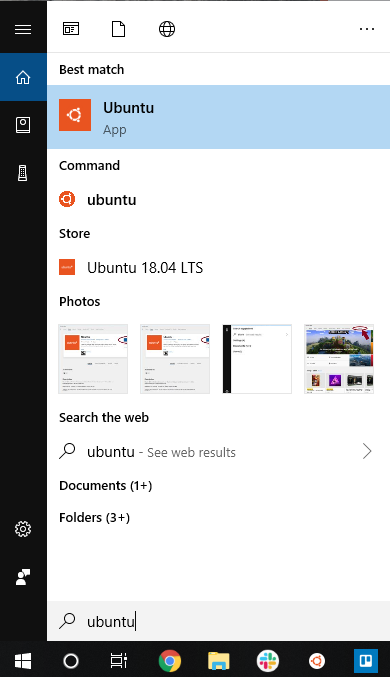

# Login


The Lawrence Supercomputer: Lawrence is composed of a many nodes. The user logs into the login node from their computer. From there they can access many other nodes in order to run analyses. The GPU node is used for graphics processing, and computations involving matrices. The high-memory \(himem\) node contains increased RAM for jobs that require high memory. The VIZ node is used for making visualizations. Besides the special purpose nodes, Lawrence contains 80 computational nodes for data analysis.  The data storage nodes act like a harddrive, albeit much faster, storing the files that are on the user's \(or lab's\) account.  Caution: the storage nodes are not backed up-be sure to back up your files.  The management node is utilized for managing the system.

## Lawrence SSH Login for Mac

To start you will need to open a terminal or command line interface.

Next, you will need to login via an ssh session through the login node. You must be given access by the HPC administrator \(which can be requested by contacting the HelpDesk\). Login as below:

```text
[user@localhost ~]$ ssh User.Name@lawrence.usd.edu
```

You will then be prompted for a password. Enter your regular USD credentials. If you have more than five failed attempts at logging in, you will be locked out for one hour or until access is reinstated by the system administrator.


Note: the password you type will not show up on the screen.


```text
User.Name@lawrence.usd.edu's password:
```

Once logged in successfully, all users should get their last login and a command line prompt:

```text
Last login: (date and address here)
### Other information.... ###
###                       ###
###                       ###
[user.name@usd.local@login ~]$
```

All login goes by default to the login node. Do not run compute jobs on the login node! Please read further instructions on how to use Slurm, the Lawrence cluster workload manager.


## Lawrence SSH Login for Linux

Open the command terminal, and ssh into Lawrence

```text
username@NI8724:~$ ssh -X User.Name@Lawrence.usd.edu
User.Name@lawrence.usd.edu's password:
```


Note: your password won't show up while being typed.


If it accepts the password, it will show a welcome message and a prompt.

```text
Last login: Tue Aug 20 16:03:26 2019 from 192.236.54.40
Welcome to the Lawrence Supercomputer at the University of South Dakota!
...

(base) [user.name@usd.local@login ~]$
```

## Lawrence SSH Login for Windows

There are two options given in this tutorial for logging into Lawrence on a Windows machine:  Using MobaXterm, or using the Ubuntu terminal.  For the MobaX tutorial, please continue.  For the tutorial using Ubuntu, please skip ahead to the section "Using the Ubuntu terminal".

### Using the MobaXterm terminal

Utilization of the Lawrence cluster by Windows users requires the use of the MobaXterm terminal. MobaXterm can be freely downloaded here \(use the Home Installer Edition\):

[https://mobaxterm.mobatek.net/download.html](https://mobaxterm.mobatek.net/download.html)


Once downloaded, open the MobaX terminal.  Click "Start local terminal".


The command line prompt will appear:


You can then ssh onto the Lawrence cluster \(same command as Linux/Mac\). You will be prompted for a password, which is your USD credentials. As a security feature, three incorrect logins will result in your account being locked until the lockout expires or an administrator overrides it.


Note: the password will not show when typing.


```text
[2018-11-19 10:55.23]  ~
[User.Name.NI11018] ➤ ssh User.Name@lawrence.usd.edu
User.Name@lawrence.usd.edu's password:
Last login: Mon Dec 25 19:37:34 2017 from ni11018.usd.local
[user.name@usd.local@login ~]$
```

You will be given a prompt to begin typing commands. All logins go to the login node by default. Do not run compute jobs on the login node! Please read further instructions on how to use Slurm, the Lawrence cluster workload manager.


### Using the Ubuntu terminal

Ubuntu for Windows is available on the Microsoft store.  To begin, search for the Microsoft Store in the search bar in Windows


Search for "ubuntu" in the search bar of the store.


Select the Ubuntu app.


Click "Get", then "Install".


#### Logging in

Open the Ubuntu terminal from Start



Log in to Lawrence


Note: your **password** will **not show up** as you type- it will look like nothing is happening.  It may seem strange, but keep typing, it is picking up your keystrokes.


```text
username@NI8724:~$ ssh -X User.Name@Lawrence.usd.edu
User.Name@lawrence.usd.edu's password:
```

If it accepts the password, it will show a welcome message and a prompt \(a line that ends with '$'\).

```text
Last login: Tue Aug 20 16:03:26 2019 from 192.236.54.40
Welcome to the Lawrence Supercomputer at the University of South Dakota!
...

(base) [user.name@usd.local@login ~]$
```

