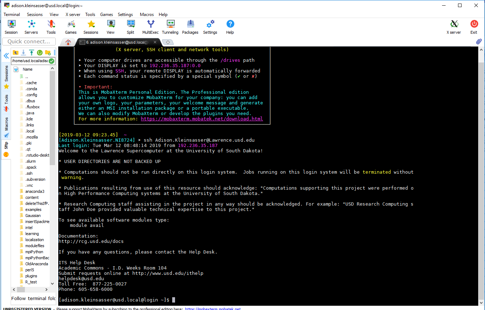
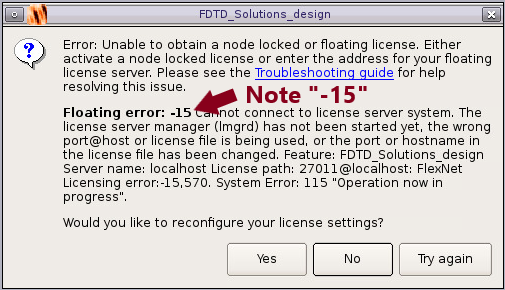
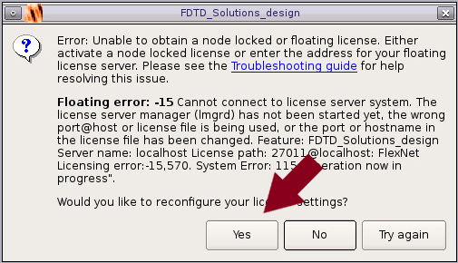
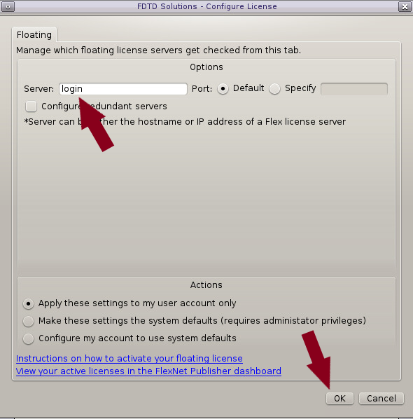
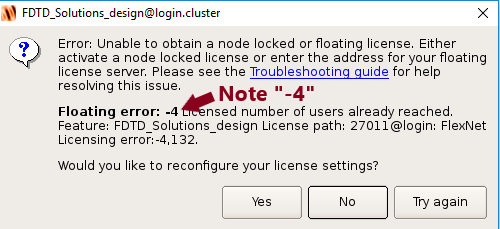

# Lumerical \(FDTD\) on Lawrence GUI Tutorial


To use Lumerical on a Lawrence GUI, you must first have access to use the license.  Please ensure you have access before continuing.


This is a step-by-step guide for running Lumerical on a graphical user interface \(GUI\) on Lawrence. 


If you have **done this before** on the computer ****you are **currently using,** you may **skip to** the section "Opening Lumerical on a Lawrence GUI".


## **Installations**

### Install MobaXterm \(MobaX\)

Go to the MobaXterm website [here](https://mobaxterm.mobatek.net/download-home-edition.html). Click on the "MobaXterm Home Edition v11.1 \(Home Installer Edition\)" button.


Click on the installed file, and follow the download wizard.

## Opening Lumerical on a Lawrence GUI

Open MobaXterm \(MobaX\) and log into Lawrence.

```text
[User.NI1111] ➤ ssh User.Name@Lawrence.usd.edu
password: 
Last login: Tue Feb 26 10:36:10 2019 from 192.236.35.187 Welcome to the Lawrence Supercomputer at the University of South Dakota!
.....
[user.name@usd.local@login ~]$
```


Note: When logging in with a terminal other than MobaX, add a flag to the login \(see the tab "[Login](https://usdrcg.gitbook.io/docs/lawrence-hpc/login)" for details\):

Windows/Linux:

```text
ssh -X User.Name@Lawrence.usd.edu
```

Mac:

```text
ssh -Y User.Name@Lawrence.usd.edu
```




Load the Lumerical-FDTD module.

```text
[user.name@usd.local@login ~]$ module load lumerical
[user.name@usd.local@login ~]$ module list
Currently Loaded Modulefiles:
  1) lumerical
```

Start Lumerical

```text
[user.name@usd.local@login ~]$ srun fdtd-solutions
```


If you receive an error message "-15" or "-4", please continue


### Error -15



Click "yes" to open your license settings.



Ensure that the server listed is "login".  Change this if needed, and click "ok".



If it doesn't automatically pop up, try starting fdtd-solutions again. 

```text
[user.name@usd.local@login ~]$ srun fdtd-solutions
```

 If a license error still comes up, it is possible that you don't have a license.  If that is not the case, please contact the Service desk \(servicedesk@usd.edu\) for assistance.  Be sure to include the name of the software, the fact that you are on Lawrence, and a description of the error in your email.

### Error -4

If the error looks like this:



The license is already in use, and the maximum number of users has been reached.  Please try again later.

