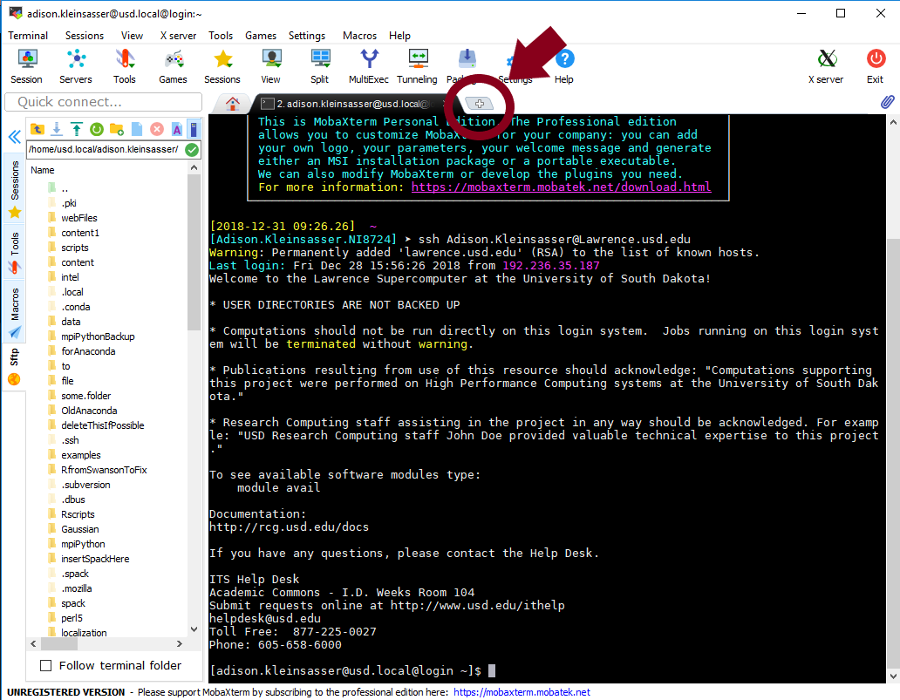
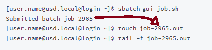
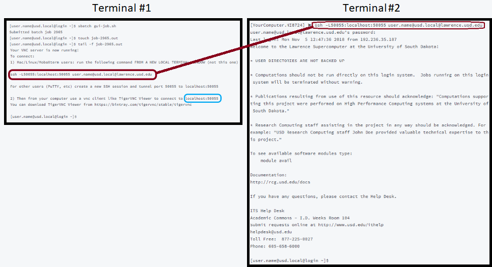
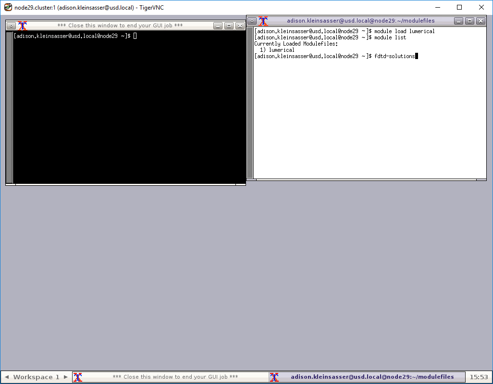

# Lumerical \(FDTD\) on Lawrence GUI Tutorial


To use Lumerical on a Lawrence GUI, you must first have access to use the license.  Please ensure you have access before continuing.


This is a step-by-step guide for running Lumerical on a graphical user interface \(GUI\) on Lawrence. 


If you have **done this before** on the computer ****you are **currently using,** you may **skip to** the section "Opening Lumerical on a Lawrence GUI".


## **Installations**

### Install MobaXterm \(MobaX\)

Go to the MobaXterm website [here](https://mobaxterm.mobatek.net/download-home-edition.html). Click on the "MobaXterm Home Edition v11.1 \(Home Installer Edition\)" button.


### Install TigerVNC

Go to the TigerVNC website [here](https://bintray.com/tigervnc/stable/tigervnc). Click on the first source code link:


Click on the installed file, and follow the download wizard.

## First Time Setup

Open MobaXterm \(MobaX\) and log into Lawrence.

```text
[User.NI1111] ➤ ssh User.Name@Lawrence.usd.edu
password: 
Last login: Tue Feb 26 10:36:10 2019 from 192.236.35.187 Welcome to the Lawrence Supercomputer at the University of South Dakota!
.....
[user.name@usd.local@login ~]$
```


If you haven't made a VNC password before, do this now:

```text
[user.name@usd.local@login ~]$ vncpasswd
Password:
Verify:
```


Note: the password will not show when typing.


## Opening Lumerical on a Lawrence GUI

In MobaX, open a second terminal by clicking the "+" tab.  This will be used in a moment.



In the first terminal, begin a batch GUI job.

#### Terminal \#1:




Note: the numbers in job-2965.out **correspond** to the number of the **batch job** in the second line \(the number in your command line will likely be different\).

**If the number from the example above** was typed into the "touch" and "tail" commands, rather than the number from your terminal, and the prompt "\[user.name@usd.local@login ~\]$ " hasn't reappeared, hit **Ctrl-C** to get it back, then **repeat** the "touch" and "tail" commands, using the **number that appears in your terminal**.


The tail -f command will print the last few lines of the file, which looks like this:

#### Terminal \#1:


Copy the ssh command \(it will look like the command **circled in red above**\) and **paste** it into the **second terminal** \(then press "enter"\).  It will then ask for a password. \(This is the password you would use to log in to Lawrence, **not the vnc password**.\)  The password will **not appear** as it is typed in.

#### Terminal \#2:



#### VNC Viewer

Open TigerVNC from your start menu, copy the localhost \(it will look like what is circled in blue in command line \#1\), and paste it into the "NVC Viewer: Connection Details" window.  **Click "Connect"**.


The window will then ask for a password. Type in the **VNC password** you made earlier.


Your VNC window will then pop up.


Open a new terminal.


Load the Lumerical-FDTD module.

```text
[user.name@usd.local@node55 ~]$ module load lumerical
[user.name@usd.local@node55 ~]$ module list
Currently Loaded Modulefiles:
  1) lumerical
[user.name@usd.local@node55 ~]$ fdtd-solutions

```




If you do this, and receive an error like the one below, follow these steps:



Click "yes" to open your license settings.


Ensure that the server listed is "login".  Change this if needed, and click "ok".


If it doesn't automatically pop up, try starting fdtd-solutions again. 

```text
[user.name@usd.local@node55 ~]$ fdtd-solutions
```

 If a license error still comes up, it is possible that you don't have access to the license, or that someone else is using the license.  

