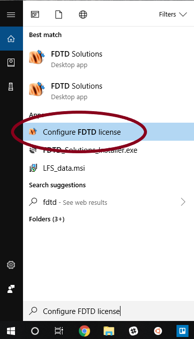
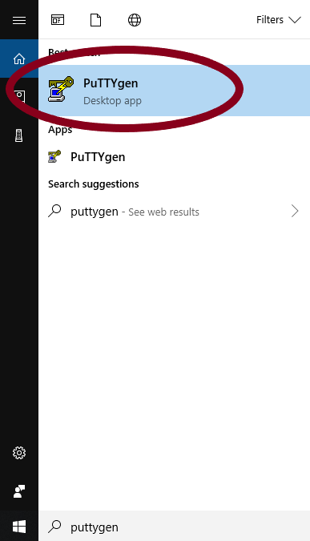
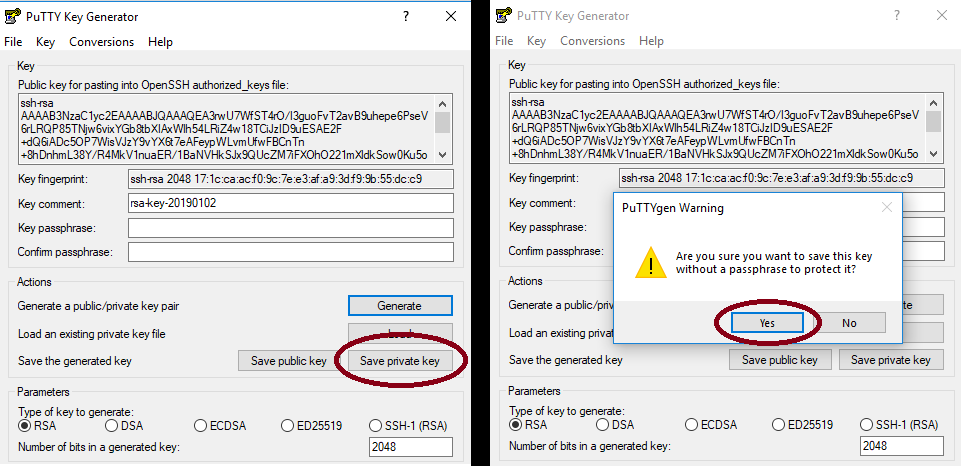
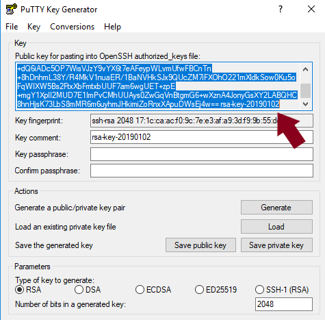
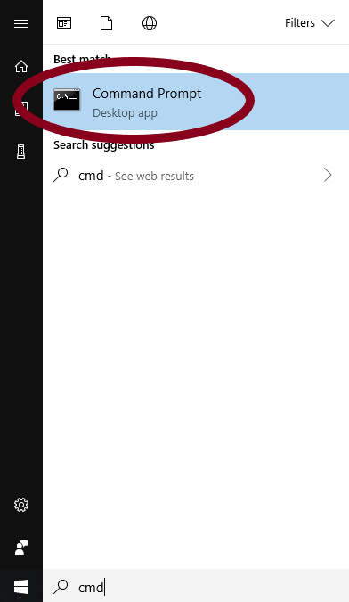
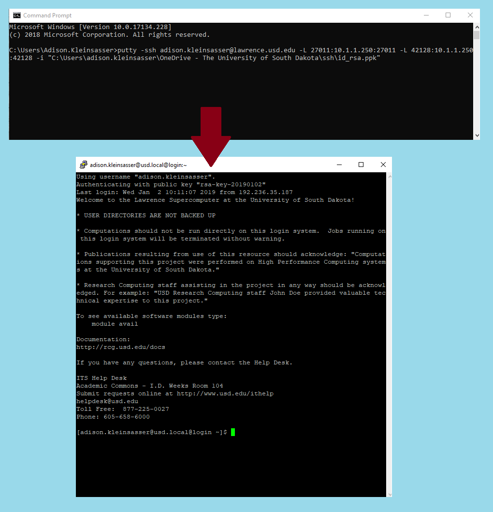

# Lumerical \(FDTD\) on Windows PC Tutorial


If you have **done this before** on the computer ****you are **currently using,** and **haven't \(re\)activated** a Lumerical licence on it since, you may **skip to** the section "Open a PuTTY Session to Tunnel Lumerical from Lawrence".  


## Disable any local node-locked license on your PC

Open the "Configure FDTD License" app on your PC



Click on the "Node Locked" tab, then the "Licenses" subtab.  Highlight your license, and select "Deactivate". Note that your license will likely have a **limit** on the number of times you may deactivate and reactivate it.  Click "Yes", then "Ok".


Note: if this **causes you concern**, you may also use Lumerical on Lawrence directly, **without deactivating** the license on your computer.  See the next page: "Lumerical \(FDTD\) on Lawrence GUI".



## **Installations**

### **Install MobaXterm**

Go to the MobaXterm website [here](https://mobaxterm.mobatek.net/download-home-edition.html). Click on the "MobaXterm Home Edition v11.1 \(Home Installer Edition\)" button.


### Install PuTTY

Go to [https://www.putty.org/](https://www.putty.org/)

Click the link "here" to go to the download page. 


Select the 32-bit installer link to download the PuTTY installer.  When the download is complete, click on the button in the bottom left corner of the browser to open the installer.


Install PuTTY with the installer


A README file will pop up.  You may ignore it for now while following this tutorial, but you may find the information useful when using PuTTY on your own.

Open a PuTTY window


## First Time Set-up

### Make Private & Public Keys

Open PuTTYgen \(not PuTTY from the last section\).



Select "Generate", then wave your mouse around in a haphazard fashion.


Save the private key.  \(If asked whether you are sure about saving without passphrase protection, click "yes".  **Remember** where you save it.  **Save** the key as **id\_rsa.ppk**.



**Copy** the public key \(make sure you get **all of it**-there will likely be **more lines than fit in the text area** at once\).



### Add Key to Authorized Keys

Open MobaX and start a local terminal.


The command line prompt will appear:


You can then ****ssh onto the Lawrence cluster. You will be prompted for a password, which is based on your USD credentials. As a security feature, three incorrect logins will result in your account being locked until the lockout expires or an administrator overrides it.

```text
[2018-11-19 10:55.23]  ~
[User.Name.NI11018] ➤ ssh User.Name@Lawrence.usd.edu
User.Name@lawrence.usd.edu's password:
Last login: Mon Dec 25 19:37:34 2017 from ni11018.usd.local
[user.name@usd.local@login ~]$
```


Note: the password will not show when typing.


 Then open your authorized\_keys file

```text
[user.name@usd.local@login ~]$ cd
[user.name@usd.local@login ~]$ cd .ssh/
[user.name@usd.local@login .ssh]$ nano authorized_keys
```

A text editor \(nano\) will open, showing your keys. Press your **down-arrow key** once to go to the next line. **Paste** \(right click, select paste\) your **public key** into the file.  \(Ctrl-v won't work in MobaX for pasting.\)

Click **Ctrl-o**, then **Enter** to save, and then **Ctrl-x** to exit.



If the pasted line looks **shorter than the other line\(s\)**, but you are **certain you copied all of the public key**, don't worry- use the left arrow key to move past the left end of the pasted line, and the line will scroll, showing the rest of it.


## Tunnel Lumerical from Lawrence

Open a Windows Command Line



Connect to the Lawrence license, replacing "user.name" with your username on Lawrence, and path\to\your\file with the path to the id\_rsa.ppk file:

```text
C:\Users\User.name>putty -ssh user.name@lawrence.usd.edu -L 27011:10.1.1.250:27011 -L 42128:10.1.1.250:42128 -i "C:\Users\user.name\path\to\your\file\id_rsa.ppk"
```

A new window will appear. It may ask for a password to log into Lawrence.


Note: your password will not appear as you type -- nothing will -- just keep typing as if it did.




You may now open the Lumerical software on your desktop.

