# Submitting Jobs

## Types of Jobs:

Lawrence has three methods of job submission: **interactive,** **batch, and GUI** (graphical user interface).

**Interactive jobs**: An interactive job, as its name suggests, is the more **user-involved**. Users request a node (please don't perform computations in the login node), and then perform computations or analysis by **directly typing commands** into the command line. Interactive jobs end if the user logs off of Lawrence.

**Batch jobs:** Batch jobs are designed to run one or more scripts (python, C, etc.) on one or more files through a **pre-written script**. These **do not need interaction** with the user once they have been submitted in the terminal (either started on a node, or put in Lawrence's queue if the desired node is in use). Batch scripts **continue to run** if the user logs off of Lawrence.

**GUI jobs**: It is possible to open some types of software in a window on Lawrence.  Software such as Firefox, Gaussian, Lumerical, and RStudio can be opened and used in a manner similar to how they would be used on a desktop. &#x20;

## Slurm

The Slurm Workload Manager is the job scheduler used by the Lawrence HPC, it is the proper way to get access to compute resources on the cluster. For a comprehensive overview of Slurm commands, visit the Slurm webpage: [https://slurm.schedmd.com/quickstart.html](https://slurm.schedmd.com/quickstart.html)

For the commonly used Slurm commands on the Lawrence HPC, we have provided quick-start documentation with examples within the Wiki.

### Partitions

There are six main Slurm partitions on Lawrence: the default partition (short), normal job partition (nodes), preemptible partition (preemptible), high memory partition (himem), graphics processing partition (gpu), and visualization partition (viz). For an in-depth overview of Slurm preemption, please visit the corresponding Slurm [webpage](https://slurm.schedmd.com/preempt.html).

#### Short (default) Partition

The default Slurm partition is called “short” and is meant to run short and interactive jobs for up to two hours on a general compute node/s. When running the sbatch or srun command without passing any -p arguments, your job will be scheduled on the “nodes” partition.

```
[user.name@usd.local@login ~]$ srun --pty bash
[user.name@usd.local@node23 ~]$
```

Press Ctrl+D to exit the node and return to the login node.

**Nodes Partition**

The typical Slurm partition for most jobs is called “nodes” and will run a job for up to two days on a general compute node/s. When running the sbatch or srun command pass the -p flag with the argument “nodes”, your job will be scheduled on the “nodes” partition.

```
[user.name@usd.local@login ~]$ srun --pty -p nodes bash
[user.name@usd.local@node23 ~]$
```

Press Ctrl+D to exit the node and return to the login node.

#### Preemptible Partition

To accommodate longer running jobs, users also have the option of using the preemptible partition (using the "-p preemptible" flag). This partition will allow a job to run for up to 90 days on a general compute node/s. However, if the general compute node/s is needed for a new job in the "nodes" partition, the preemptible job will be canceled (preempted) to allow the regular job to run.

```
[user.name@usd.local@login ~]$ srun --pty -p preemptible bash
[user.name@usd.local@node59 ~]$
```

Press Ctrl+D to exit the preemptible partition and return to the login node.

#### High Memory Partition

Jobs that require a large amount of memory (RAM) may be run on a high-memory (himem) node using the "-p himem" flag.

```
[user.name@usd.local@login ~]$ srun --pty -p himem bash
[user.name@usd.local@himem01 ~]$
```

Press Ctrl+D to exit the high memory partition and return to the login node.

#### Graphics Processing Unit (GPU) Partition

To use the graphics processing unit (GPU) partition, use the "-p gpu" flag.

```
[user.name@usd.local@login ~]$ srun --pty -p gpu bash
[user.name@usd.local@gpu ~]
```

Press Ctrl+D to exit the GPU partition and return to the login node.

#### Visualization Partition

For the visualization (viz) partition, use the "-p viz" flag.

```
[user.name@usd.local@login ~]$ srun --pty -p viz bash
[user.name@usd.local@viz01 ~]$
```

Press Ctrl+D to exit the visualization partition and return to the login node.

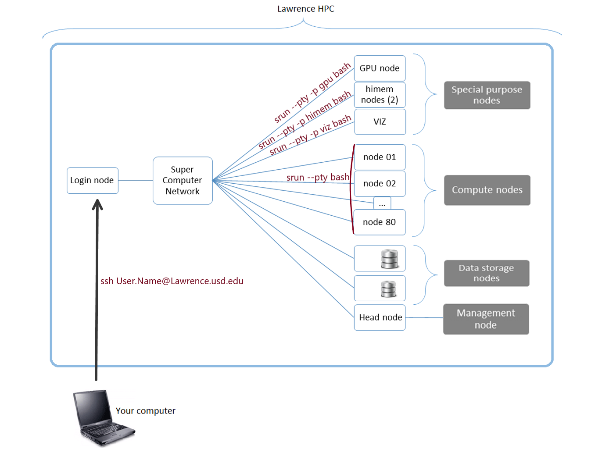

## Interactive Jobs

### General Compute

Interactive sessions on compute nodes can be used with the Slurm command "srun". For the use of one node, this command can be used generally as demonstrated below:

```
[user.name@usd.local@login ~]$ srun --pty bash
[user.name@usd.local@node37 ~]$
```

### HiMem

The Lawrence high-memory (himem) partition has two nodes, each with 1.5 TB of RAM. This node is especially useful for jobs requiring a large amount of memory and can be accessed either interactively or with a batch script.

For interactive jobs on the Lawrence himem nodes, use the srun command as follows:

```
[user.name@usd.local@login ~]$ srun --pty -p himem bash
[user.name@usd.local@himem02 ~]$
```

### GPU

When requesting a new GPU node, the access to a GPU device must be explicitly requested using the "--gres" parameter. The format for requesting a generic resource (gres) is TYPE:LABEL:NUMBER. On Lawrence, type will always be "gpu", and label will be either "pascal" or "volta".

NUMBER is the number of GPUs being requested per node. On Lawrence there are six GPU nodes: GPU01, which has two pascal GPUs, and GPU02 through GPU06, which have one volta GPU each. The number of GPUs per node is what this NUMBER is requesting. So for the GPU01 pascal node, "1" or "2" can be used depending on how many GPUs your workflow requires, but for GPU02 through GPU06, "1" is needed.\\


If **requesting one pascal GPU**, please request **half the cores** as well. If all the cores are requested in one pascal GPU, the other pascal GPU will be **held idle**.


#### An example command to request one GPU would be as follows:

```
[user.name@usd.local@login ~]$ srun --pty -p gpu --gres=gpu:pascal:1 -B 1:12 bash
[user.name@usd.local@gpu01 ~]$
```


\-B 1:12 requests 12 cores (half of the total 24 cores).


**or**

```
[user.name@usd.local@login ~]$ srun --pty -p gpu --gres=gpu:volta:1 bash
[user.name@usd.local@gpu02 ~]$
```

#### For **more than one** GPU, use:

```
[user.name@usd.local@login ~]$ srun --pty -p gpu --gres=gpu:pascal:2 bash
[user.name@usd.local@gpu01 ~]$
```


The number "**2"** indicates two GPUs.


or

```
[user.name@usd.local@login ~]$ srun --pty -p gpu --gres=gpu:volta:1,gpu:volta:1,gpu:volta:1 bash
[user.name@usd.local@gpu02 ~]$
```


(The number of "gpu:volta:1" listed indicated the **number of GPUs** requested.)


After being allotted a GPU, to list the stats of your allocated GPU(s), use:

```
nvidia-smi
```

## Batch Jobs

To make submitting a batch job easier, there are a few templates available for the general nodes, the high memory nodes, and the GPU node. There is also a template for setting up a parallel job using MPI. To use a template, copy the template directory into one of your directories:

```
[user.name@usd.local@login ~]$ cp -r /opt/examples/ ./
```

&#x20;                                                                          **or**

```
[user.name@usd.local@login ~]$ cp -r /opt/examples/ $HOME/your/directoryPath/here
```

Open the desired template with an editor such as nano, and edit the contents as needed.

#### General Compute

Batch jobs can be submitted on the Lawrence cluster using the sbatch command.

```
[user.name@usd.local@login ~]$ sbatch simple-template.sh
```

A variety of configurations can be used for formulating a batch script. A basic batch script will look like the one below:

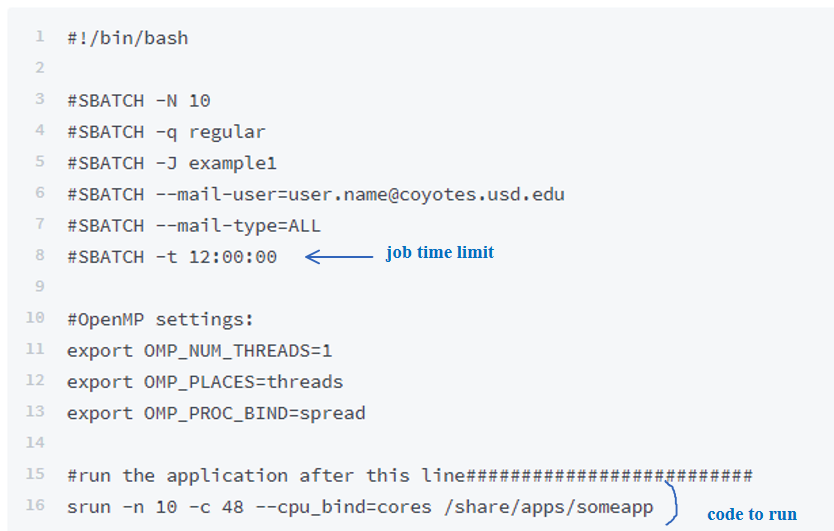

### Nodes

Below is an example batch script, called simple-template.sh in the example template directory (/opt/examples/simple-template.sh). This template can be followed when requesting a node on Lawrence:

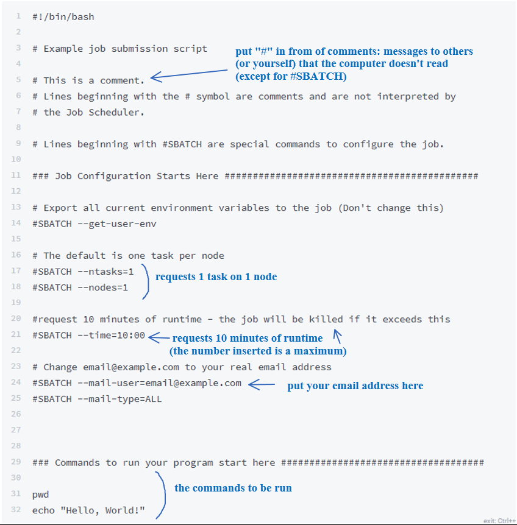

### HiMem

To use a high memory node within a batch job, add “--partition=himem” to your script.

Below is an example batch script which calls the a high-memory node. This template (/opt/examples/himem-template.sh) can be followed when requesting the himem node on Lawrence:

.png>)

### GPU

Below is an example batch script which calls the GPU node, this template (/opt/examples/gpu-template.sh) can be followed when requesting a GPU node on Lawrence:

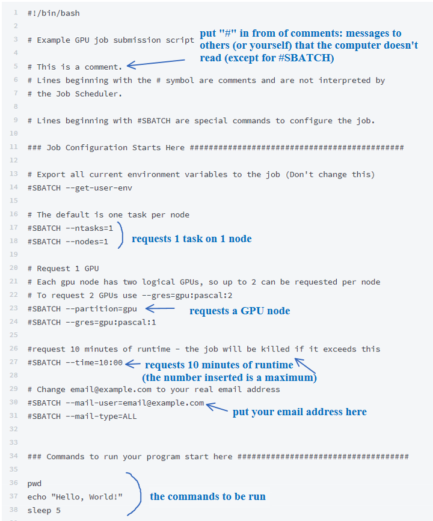

### Python for Graphs/Visual Products (Elephant example)

Python scripts can be used to produce visual products on Lawrence. As an example, we have provided a batch script (/opt/examples/elephant/elephant-template.sh) that calls a python script (elephant.py) which produces a .png file containing a graph with a line shaped like an elephant:

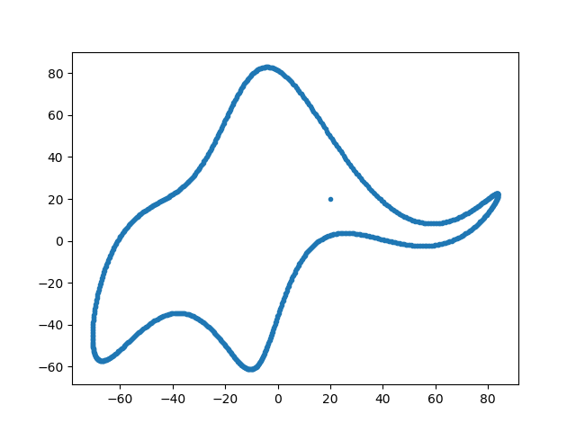

Job script:


```
#!/bin/bash

# Example job submission script

# ensure anaconda is installed
# install with /apps/install-anaconda.sh

# This is a comment.
# Lines beginning with the # symbol are comments and are not interpreted by
# the Job Scheduler.

# Lines beginning with #SBATCH are special commands to configure the job.

### Job Configuration Starts Here #############################################


# Export all current environment variables to the job (Don't change this)
#SBATCH --get-user-env

# The default is one task per node
#SBATCH --ntasks=1
#SBATCH --nodes=1

#request 10 minutes of runtime - the job will be killed if it exceeds this
#SBATCH --time=10:00

# Change email@example.com to your real email address
#SBATCH --mail-user=email@example.com
#SBATCH --mail-type=END


### Commands to run your program start here ####################################

pwd
echo "This is the elephant example"

python elephant.py
```


Python script:


```
"""
Author: Piotr A. Zolnierczuk (zolnierczukp at ornl dot gov)

Based on a paper by:
Drawing an elephant with four complex parameters
Jurgen Mayer, Khaled Khairy, and Jonathon Howard,
Am. J. Phys. 78, 648 (2010), DOI:10.1119/1.3254017
"""
import numpy as np
import matplotlib
matplotlib.use('Agg')
import matplotlib.pyplot as pylab
# import pylab


# elephant parameters
p1, p2, p3, p4 = (50 - 30j, 18 +  8j, 12 - 10j, -14 - 60j )
p5 = 40 + 20j # eyepiece

def fourier(t, C):
    f = np.zeros(t.shape)
    A, B = C.real, C.imag
    for k in range(len(C)):
        f = f + A[k]*np.cos(k*t) + B[k]*np.sin(k*t)
    return f

def elephant(t, p1, p2, p3, p4, p5):
    npar = 6
    Cx = np.zeros((npar,), dtype='complex')
    Cy = np.zeros((npar,), dtype='complex')

    Cx[1] = p1.real*1j
    Cx[2] = p2.real*1j
    Cx[3] = p3.real
    Cx[5] = p4.real

    Cy[1] = p4.imag + p1.imag*1j
    Cy[2] = p2.imag*1j
    Cy[3] = p3.imag*1j

    x = np.append(fourier(t,Cx), [-p5.imag])
    y = np.append(fourier(t,Cy), [p5.imag])

    return x,y

x, y = elephant(np.linspace(0,2*np.pi,1000), p1, p2, p3, p4, p5)
pylab.plot(y,-x,'.')
print("Saving figure")
pylab.savefig('elephant.png')

#pylab.show()
print("Done")
```


### R

R is a commonly used language to make visualizations. Provided in the /opt/examples/Rscripts folder is an example R script (exampleScript.R) and a batch script (R-batch-tempate.sh) for running it in batch. (The file data.csv in the same directory contains the data used.)

Batch script (R-batch-template.sh)

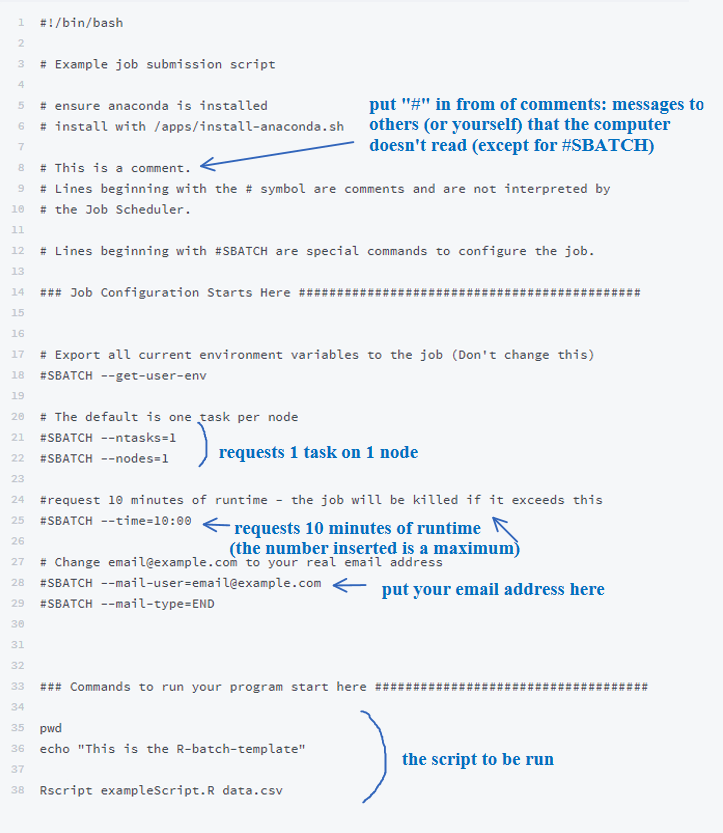

R script (exampleScript.R)


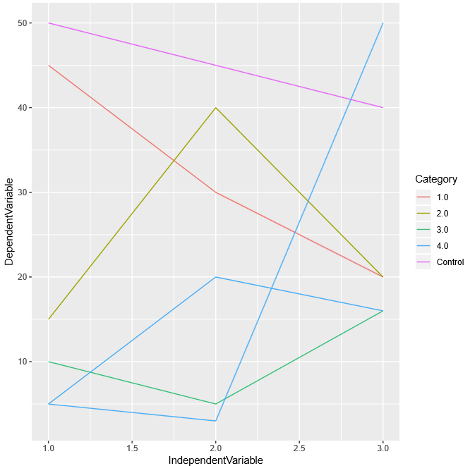

### MPI

MPI is a software environment used to divide work among multiple processors. Below is a template script (/opt/examples/mpi/mpi-template.sh) and example MPI program written in the C language (mpi\_hello\_world.c). Both can be found in /opt/examples/mpi/.

 (1) (1) (1).png>)

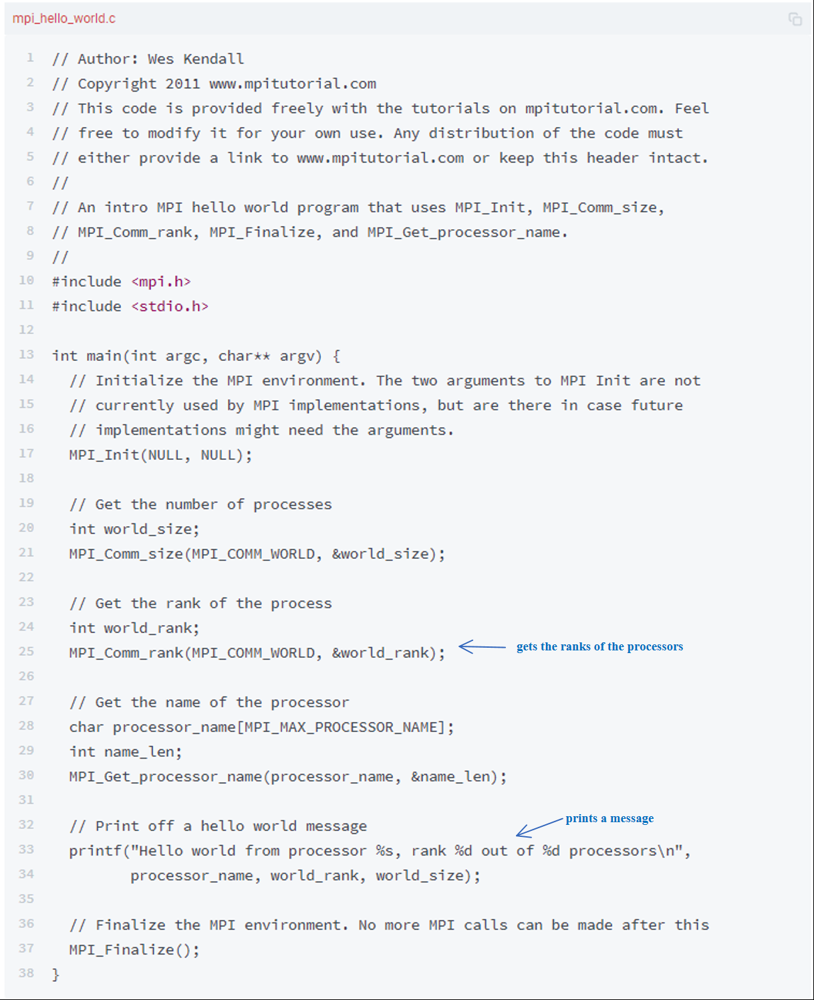

### MPI-python

Some researchers prefer the python programming language, rather than C. If this is true of you, a python mpi template script is also available. Before beginning, ensure that you have **Anaconda (or Bioconda) installed on your Lawrence login**. If you don't have one of these, install as below (it will take a few minutes). When the Anaconda installer asks if you would like to add the Anaconda commands to your path, select yes.

```
[user.name@usd.local@login ~]$ /apps/install-anaconda.sh
……
installation finished.
Do you wish the installer to prepend the Anaconda3 install location
to PATH in your /home/usd.local/adison.kleinsasser/.bashrc ? [yes|no]
[no] >>> yes

Appending source /home/usd.local/adison.kleinsasser/anaconda3/bin/activate to /home/usd.local/adison.kleinsasser/.bashrc
A backup will be made to: /home/usd.local/adison.kleinsasser/.bashrc-anaconda3.bak


For this change to become active, you have to open a new terminal.

Thank you for installing Anaconda3!

===========================================================================
```

Make sure that no other modules are loaded, and remove them if needed. You can use the "which" command to verify that you are using the python and mpirun commands from Anaconda.

```
[user.name@usd.local@login ~]$ module list
Currently Loaded Modulefiles:
  1) openmpi-2.0/gcc
[user.name@usd.local@login ~]$ module purge
[user.name@usd.local@login ~]$ module list
No Modulefiles Currently Loaded.
[user.name@usd.local@login ~]$
[user.name@usd.local@login ~]$ which python
~/anaconda3/bin/python
[user.name@usd.local@login ~]$ which mpirun
~/anaconda3/bin/mpirun
.....
```

Below is a template script (mpi-python-template.sh) and example MPI program written in the python language (csvIntoPython.py). This python script reads a csv file, and prints the data to a slurm file (slurm-00000.out). Both templates can be found in "/opt/examples/mpi/".

.png>)

## Graphical User Interface (GUI) jobs

Log into Lawrence, using a flag for Mac or Linux:

**MobaX** on Windows:

```
[User.Name.NI11018] ➤ ssh User.Name@lawrence.usd.edu
```

**Mac OS**:

```
ITSCkMac07:~ user.name$ ssh -Y User.Name@lawrence.usd.edu
```

**Linux:**

```
username@NI8724:~$ ssh -X User.Name@Lawrence.usd.edu
```

Request a node:

```
[user.name@usd.local@login ~]$ srun --pty bash
[user.name@usd.local@node51 ~]$
```

Run a **graphical software** on a node (such as **Lumerical**, **Gaussian**, or **Firefox**):

If the software is part of a module, it will need to be loaded first:

```
[user.name@usd.local@node51 ~]$ module load module_name 
[user.name@usd.local@node51 ~]$ module list
Currently Loaded Modulefiles:
  1) module_name
```


Note: if you don't remember the exact name of the necessary module, the command`module avail`will show all the available modules.


Then run the software:

`[user.name@usd.local@node51 ~]$ name_of_software`

See below for specific examples:

### Firefox example

Run Firefox:

```
[user.name@usd.local@login ~]$ srun --pty bash
[user.name@usd.local@node51 ~]$ firefox
```

The GUI will open:

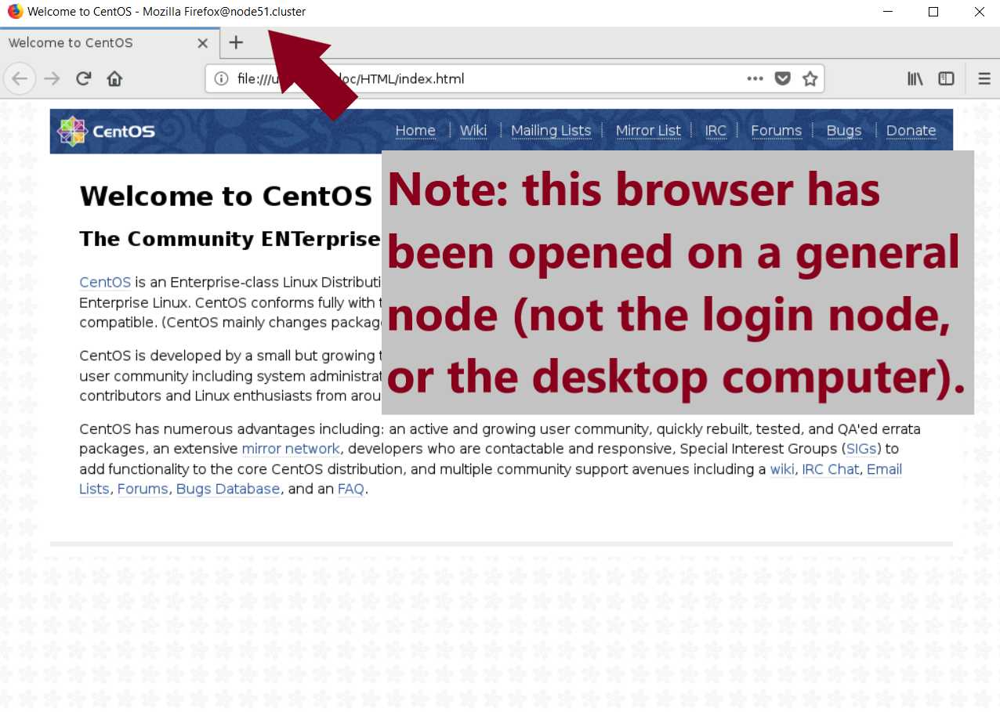

There may be a list of 200 or more of this error:

`(firefox:189943): dconf-CRITICAL **: unable to create directory '/run/user/1093713210/dconf': Permission denied. dconf will not work properly.`

If this error appears, it's nothing to worry about.

### Gaussian example


Note: you must have a license for Gaussian on Lawrence for this tutorial.

If you have a license, but it is not on Lawrence yet, please contact the Research Computing Group for assistance.


Load the Gaussian module:

```
[user.name@usd.local@login ~]$ srun --pty bash
[user.name@usd.local@node51 ~]$ module load gaussian/16 
[user.name@usd.local@node51 ~]$ module list
Currently Loaded Modulefiles:
  1) gaussian/16
```

Launch the Gaussian GUI;

`[user.name@usd.local@node51 ~]$ gview`

The GUI will open:

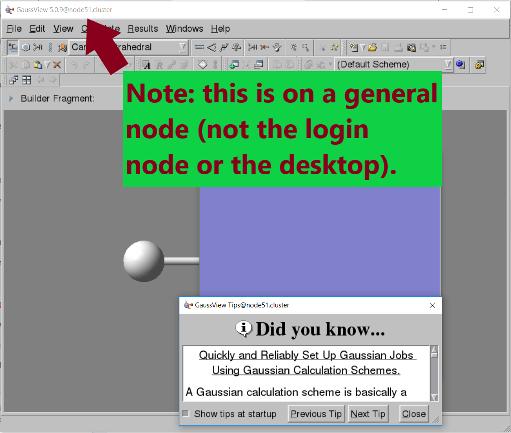

### Lumerical example


Note: you must have a license for Lumerical on Lawrence for this tutorial.

If you have a license, but it is not on Lawrence yet, please contact the Research Computing Group for assistance.


Launch the Lumerical GUI

```
[user.name@usd.local@login ~]$ srun --pty bash
[user.name@usd.local@node51 ~]$ module load lumerical
[user.name@usd.local@node51 ~]$ module list
Currently Loaded Modulefiles:
  1) lumerical
[user.name@usd.local@node51 ~]$ srun fdtd-solutions
```


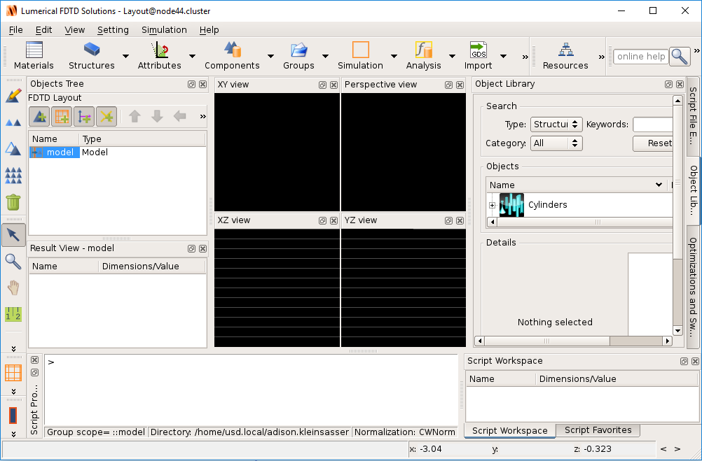

