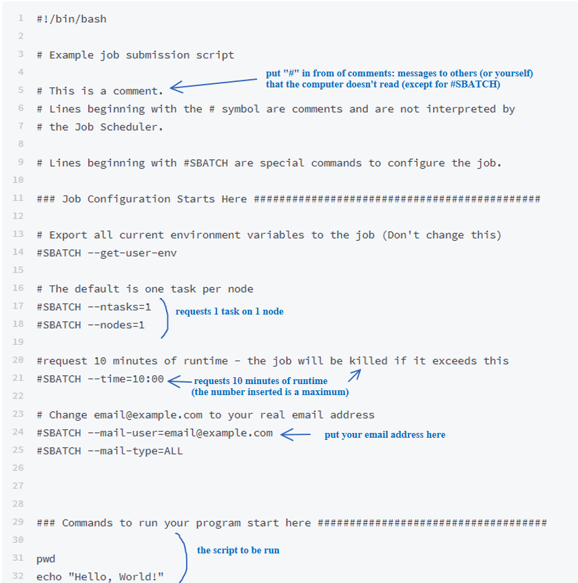
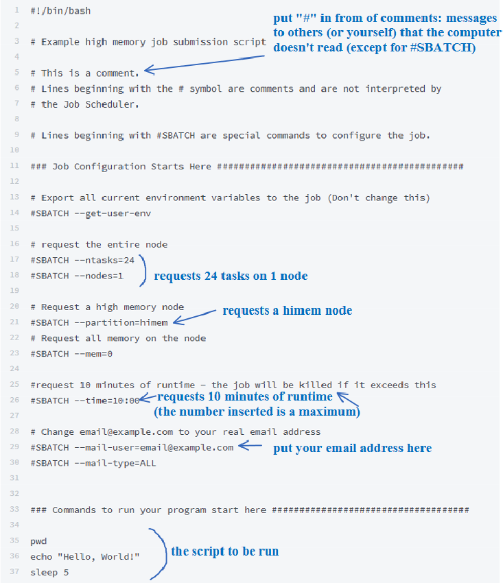
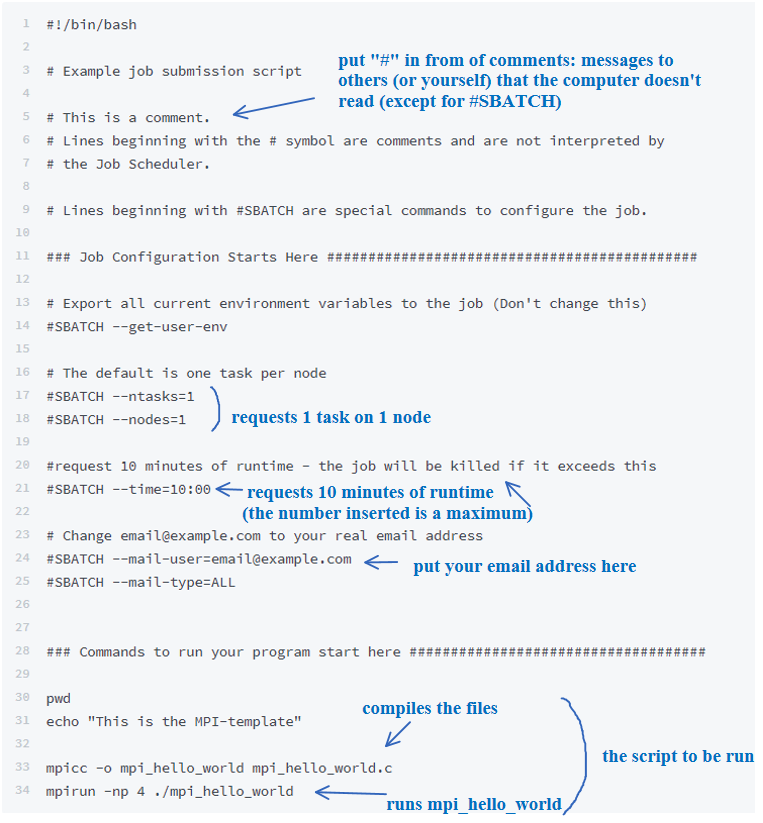

# Submitting Jobs

## Types of Jobs:

Lawrence has two methods of job submission: **interactive** and **batch**. 

**Interactive jobs**: An interactive job, as its name suggests, is the more **user-involved**. Users request a node \(please don't perform computations in the login node\), and then perform computations or analysis by **directly typing commands** into the command line.  Interactive jobs end if the user logs off of Lawrence.

**Batch jobs:** Batch jobs are designed to run one or more scripts \(python, C, etc.\) on one or more files through a **pre-written script**. These **do not need interaction** with the user once they have been ordered in the terminal \(either started, or put in Lawrence's queue if the desired node is in use\). Batch scripts **continue to run** if the user logs off of Lawrence.

## Slurm

The Slurm Workload Manager is the job scheduler used by the Lawrence HPC. For a comprehensive overview of Slurm commands, visit the Slurm webpage: [https://slurm.schedmd.com/quickstart.html](https://slurm.schedmd.com/quickstart.html)

For the commonly used Slurm commands on the Lawrence HPC, we have provided quick-start documentation with examples within the Wiki.

### Partitions

There are five Slurm partitions to be aware of when submitting jobs on Lawrence, the default partition \(nodes\), preemptible partition, high memory partition, graphics processing partition, and visualization partition. For an in-depth overview of Slurm preemption, please visit the corresponding Slurm [webpage](https://slurm.schedmd.com/preempt.html).

#### Nodes \(default\) Partition

The default Slurm partition is called “nodes” and will run a job for up to two days on a general compute node/s. When running the sbatch or srun command without passing any -p arguments, your job will be scheduled on the “nodes” partition.

```text
[user.name@usd.local@login ~]$ srun --pty bash
[user.name@usd.local@node23 ~]$
```

Press Ctrl+D to exit the node and return to the login node.

#### Preemptible Partition

To accommodate longer running jobs, users also have the option of using the preemptible partition \(using the "-p preemptible" flag\). This partition will allow a job to run for up to 90 days on a general compute node/s. However, if the general compute node/s is needed for a new job in the "nodes" partition, the preemptible job will be canceled \(preempted\) to allow the regular job to run.

```text
[user.name@usd.local@login ~]$ srun --pty -p preemptible bash
[user.name@usd.local@node59 ~]$
```

Press Ctrl+D to exit the preemptible partition and return to the login node.

#### High Memory Partition

Tasks that require a large memory \(RAM\) may be run on a high-memory \(himem\) node using the "-p himem" flag.  

```text
[user.name@usd.local@login ~]$ srun --pty -p himem bash
[user.name@usd.local@himem01 ~]$
```

Press Ctrl+D to exit the high memory partition and return to the login node.

#### Graphics Processing Unit \(GPU\) Partition

To use the graphics processing unit \(GPU\) partition, use the "-p gpu" flag. 

```text
[user.name@usd.local@login ~]$ srun --pty -p gpu bash
[user.name@usd.local@gpu ~]
```

Press Ctrl+D to exit the GPU partition and return to the login node.

#### Visualization Partition

For the visualization \(viz\) partition, use the "-p viz" flag.  

```text
[user.name@usd.local@login ~]$ srun --pty -p viz bash
[user.name@usd.local@viz01 ~]$
```

Press Ctrl+D to exit the visualization partition and return to the login node.

## Interactive Jobs

#### General Compute

Interactive sessions on compute nodes can be used with the Slurm command "srun". For the use of one node, this command can be used generally as demonstrated below:

```text
[user.name@usd.local@login ~]$ srun --pty bash
[user.name@usd.local@node37 ~]$
```

#### HiMem

The Lawrence high-memory \(himem\) partition has two nodes, each with 1.5 TB of RAM. This node is especially useful for jobs requiring a large amount of memory and can be accessed either interactively or with a batch script.

For interactive jobs on the Lawrence himem nodes, use the srun command as follows:

```text
[user.name@usd.local@login ~]$ srun --pty -p himem bash
[user.name@usd.local@himem02 ~]$
```

#### GPU

The GPU node must be specifically requested using the “--gres” parameter. GPU access is controlled by cgroups, which means the resource must be requested if it is to be used. This prevents use conflicts. The format for requesting the GPU node \(as specified in the contig file\) is TYPE:LABEL:NUMBER.

TYPE will be “gpu”.

LABEL is defined as “pascal” for the GPU node.

NUMBER is the amount of resources requested. For the GPU node, there are two logic units, so a user can request “1” or “2”.

An example command would be as follows:

```text
srun --pty -p gpu --gres=gpu:pascal:1 bash
```

To see which GPUs are available use the following command:

```text
nvidia-smi
```

For interactive GPU sessions, the gpu node is requested as below:

```text
[user.name@usd.local@login ~]$ srun --pty -p gpu --gres=gpu:pascal:1 bash
[user.name@usd.local@gpu01 ~]$
```

## Batch Jobs

To make submitting a batch job easier, there are a few templates available for the general nodes, the high memory nodes, and the GPU node.  There is also a template for setting up an MPI.  To use a template, copy the template directory into your home directory:

```text
[user.name@usd.local@login ~]$ cp -r /opt/examples/ $HOME
```

or

```text
[user.name@usd.local@login ~]$ cp -r /opt/examples/ $HOME/your/directoryPath/here
```

Open the desired template, and edit the contents as needed.

#### General Compute

Batch jobs can be submitted on the Lawrence cluster using Slurm commands. A variety of configurations can be used for formulating a batch script. A basic batch script will look like the one below:


#### Nodes

Below is an example batch script, called simple-template.sh in the example template directory. This template can be followed when requesting a node on Lawrence:



#### HiMem

To use a high memory node within a batch job, add “--partition=himem” to your script.

Below is an example batch script which calls the a high-memory node. This template \(examples/himem-template.sh\) can be followed when requesting the himem node on Lawrence:



#### GPU

Below is an example batch script which calls the GPU node, this template \(examples/gpu-template.sh\) can be followed when requesting a GPU node on Lawrence:


#### MPI

MPI is used to divide work among multiple processors.  Below is a template script \(mpi-template.sh\) and template C file \(mpi\_hello\_world.c\).  There is a third script, mpi\_hello\_world, in use but not shown here.




### Graphical User Interface Jobs \(VNC\)

#### **General Compute**

The example below demonstrates how to start a VNC session on a general purpose compute node:

```text
[user.name@usd.local@login ~]$ # The vncpasswd command only needs to be run once
[user.name@usd.local@login ~]$ vncpasswd
Password:
Verify:
[user.name@usd.local@login ~]$ sbatch /opt/examples/gui-job.sh
Submitted batch job 2965
[user.name@usd.local@login ~]$ touch job-2965.out
[user.name@usd.local@login ~]$ tail -f job-2965.out
job execution at: Fri Mar 9 12:30:35 CST 2018
running on node node41
using default VNC server /usr/bin/vncserver
got VNC display :2
local (compute node) VNC port is 5902
got login node VNC port 50041
Created reverse ports on login node.]

====================================================

Your VNC server is now running!
To connect:
1) Mac/Linux/MobaXterm users: run the following command FROM A NEW LOCAL TERMINAL WINDOW (not this one)
ssh -L50041:localhost:50041 user.name@usd.local@lawrence.usd.edu
For other users (PuTTY, etc) create a new SSH session and tunnel port 50041 to localhost:50041

2) Then from your computer use a vnc client like TigerVNC Viewer to connect to localhost:50041
You can download TigerVNC Viewer from https://bintray.com/tigervnc/stable/tigervnc
Stopping VNC server
Killing Xvnc process ID 313303
job 2965 execution finished at: Fri Mar 9 12:31:23 CST 2018
Type ctrl-C to return to your terminal session.
^C
[user.name@usd.local@login ~]$

### Output file is job-xxx.out
```

#### HiMem

To request a VNC session on the HiMem node, use the same commands as given under General Compute excepting the following command with sbatch:

```text
[user.name@usd.local@login ~]$ sbatch -p himem /opt/examples/gui-job.sh
```

#### GPU

To request a VNC session on the HiMem node, use the same commands as given under General Compute excepting the following command with sbatch:

```text
[user.name@usd.local@login ~]$ sbatch --gres=gpu:pascal:1 -p gpu /opt/examples/gui-job.sh
```

#### Viz

The Lawrence viz node is designed for users who wish to do advanced visualization. The viz node gives users access to accelerated 3D graphics \(one node with one GPU having a GTX logic unit\). A typical use case for the viz node is a virtual network computing \(VNC\) job coupled with a real-time graphical user interface \(GUI\). Please note that a graphical job can be run on any node on the cluster and is not solely limited to the viz node \(although the viz node will often have the best performance\).

Viz nodes must be specifically requested using the “--gres” parameter. Viz access is controlled by cgroups, which means the resource must be requested if it is to be used. This prevents use conflicts. The format for requesting the GPU node \(as specified in the contig file\) is TYPE:LABEL:NUMBER.

TYPE will be “vis”.

LABEL is defined as “gtx” for the viz node.

NUMBER is the amount of resources requested. For the Vis node the only option is “1” as there is only one.

To request a VNC session on the HiMem node, use the same commands as given under General Compute excepting the following command with sbatch:

```text
[user.name@usd.local@login ~]$ sbatch --gres=gpu:gtx -p viz /opt/examples/gui-job.sh
```

### 

