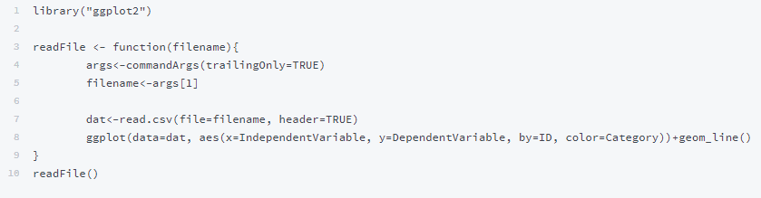

# Submitting Jobs

## Types of Jobs:

Lawrence has two methods of job submission: **interactive** and **batch**. 

**Interactive jobs**: An interactive job, as its name suggests, is the more **user-involved**. Users request a node \(please don't perform computations in the login node\), and then perform computations or analysis by **directly typing commands** into the command line.  Interactive jobs end if the user logs off of Lawrence.

**Batch jobs:** Batch jobs are designed to run one or more scripts \(python, C, etc.\) on one or more files through a **pre-written script**. These **do not need interaction** with the user once they have been submitted in the terminal \(either started on a node, or put in Lawrence's queue if the desired node is in use\). Batch scripts **continue to run** if the user logs off of Lawrence.

## Slurm

The Slurm Workload Manager is the job scheduler used by the Lawrence HPC. For a comprehensive overview of Slurm commands, visit the Slurm webpage: [https://slurm.schedmd.com/quickstart.html](https://slurm.schedmd.com/quickstart.html)

For the commonly used Slurm commands on the Lawrence HPC, we have provided quick-start documentation with examples within the Wiki.

### Partitions

There are five Slurm partitions on Lawrence: the default partition \(nodes\), preemptible partition, high memory partition, graphics processing partition, and visualization partition. For an in-depth overview of Slurm preemption, please visit the corresponding Slurm [webpage](https://slurm.schedmd.com/preempt.html).

#### Nodes \(default\) Partition

The default Slurm partition is called “nodes” and will run a job for up to two days on a general compute node/s. When running the sbatch or srun command without passing any -p arguments, your job will be scheduled on the “nodes” partition.

```text
[user.name@usd.local@login ~]$ srun --pty bash
[user.name@usd.local@node23 ~]$
```

Press Ctrl+D to exit the node and return to the login node.

#### Preemptible Partition

To accommodate longer running jobs, users also have the option of using the preemptible partition \(using the "-p preemptible" flag\). This partition will allow a job to run for up to 90 days on a general compute node/s. However, if the general compute node/s is needed for a new job in the "nodes" partition, the preemptible job will be canceled \(preempted\) to allow the regular job to run.

```text
[user.name@usd.local@login ~]$ srun --pty -p preemptible bash
[user.name@usd.local@node59 ~]$
```

Press Ctrl+D to exit the preemptible partition and return to the login node.

#### High Memory Partition

Jobs that require a large amount of memory \(RAM\) may be run on a high-memory \(himem\) node using the "-p himem" flag.  

```text
[user.name@usd.local@login ~]$ srun --pty -p himem bash
[user.name@usd.local@himem01 ~]$
```

Press Ctrl+D to exit the high memory partition and return to the login node.

#### Graphics Processing Unit \(GPU\) Partition

To use the graphics processing unit \(GPU\) partition, use the "-p gpu" flag. 

```text
[user.name@usd.local@login ~]$ srun --pty -p gpu bash
[user.name@usd.local@gpu ~]
```

Press Ctrl+D to exit the GPU partition and return to the login node.

#### Visualization Partition

For the visualization \(viz\) partition, use the "-p viz" flag.  

```text
[user.name@usd.local@login ~]$ srun --pty -p viz bash
[user.name@usd.local@viz01 ~]$
```

Press Ctrl+D to exit the visualization partition and return to the login node.


## Interactive Jobs

#### General Compute

Interactive sessions on compute nodes can be used with the Slurm command "srun". For the use of one node, this command can be used generally as demonstrated below:

```text
[user.name@usd.local@login ~]$ srun --pty bash
[user.name@usd.local@node37 ~]$
```

#### HiMem

The Lawrence high-memory \(himem\) partition has two nodes, each with 1.5 TB of RAM. This node is especially useful for jobs requiring a large amount of memory and can be accessed either interactively or with a batch script.

For interactive jobs on the Lawrence himem nodes, use the srun command as follows:

```text
[user.name@usd.local@login ~]$ srun --pty -p himem bash
[user.name@usd.local@himem02 ~]$
```

#### GPU

When requesting a new GPU node, the access to a GPU device must be explicitly requested using the "--gres" parameter.  The format for requesting the GPU node is TYPE:LABEL:NUMBER.  On Lawrence, type will always be "gpu", and label will always be "pascal".    

NUMBER is the number of GPUs being requested. On Lawrence, the GPU has two GPUs, and you can request one or two by specifying “1” or “2”.

An example command to request one GPU would be as follows:

```text
srun --pty -p gpu --gres=gpu:pascal:1 bash
```

To see which GPUs are available use the following command:

```text
nvidia-smi
```

Similarly, to launch an interactive job on a GPU node with the srun command, do the following:

```text
[user.name@usd.local@login ~]$ srun --pty -p gpu --gres=gpu:pascal:1 bash
[user.name@usd.local@gpu01 ~]$
```

## Batch Jobs

To make submitting a batch job easier, there are a few templates available for the general nodes, the high memory nodes, and the GPU node.  There is also a template for setting up a parallel job using MPI.  To use a template, copy the template directory into your home directory:

```text
[user.name@usd.local@login ~]$ cp -r /opt/examples/ $HOME
```

or

```text
[user.name@usd.local@login ~]$ cp -r /opt/examples/ $HOME/your/directoryPath/here
```

Open the desired template with an editor such as nano, and edit the contents as needed.

#### General Compute

Batch jobs can be submitted on the Lawrence cluster using the sbatch command. 

```text
[user.name@usd.local@login ~]$ sbatch example.sh
```

A variety of configurations can be used for formulating a batch script. A basic batch script will look like the one below:


### Nodes

Below is an example batch script, called simple-template.sh in the example template directory \(/opt/examples/simple-template.sh\). This template can be followed when requesting a node on Lawrence:


### HiMem

To use a high memory node within a batch job, add “--partition=himem” to your script.

Below is an example batch script which calls the a high-memory node. This template \(/opt/examples/himem-template.sh\) can be followed when requesting the himem node on Lawrence:


### GPU

Below is an example batch script which calls the GPU node, this template \(/opt/examples/gpu-template.sh\) can be followed when requesting a GPU node on Lawrence:


### Python for Graphs/Visual Products \(Elephant example\)

Python scripts can be used to produce visual products on Lawrence.  As an example, we have provided a batch script \(elephant-template.sh\) that calls a python script \(elephant.py\) which produces a .png file containing a graph with a line shaped like an elephant: 


Job script:



```text
#!/bin/bash

# Example job submission script

# ensure anaconda is installed
# install with /apps/install-anaconda.sh

# This is a comment.
# Lines beginning with the # symbol are comments and are not interpreted by
# the Job Scheduler.

# Lines beginning with #SBATCH are special commands to configure the job.

### Job Configuration Starts Here #############################################


# Export all current environment variables to the job (Don't change this)
#SBATCH --get-user-env

# The default is one task per node
#SBATCH --ntasks=1
#SBATCH --nodes=1

#request 10 minutes of runtime - the job will be killed if it exceeds this
#SBATCH --time=10:00

# Change email@example.com to your real email address
#SBATCH --mail-user=email@example.com
#SBATCH --mail-type=END


### Commands to run your program start here ####################################

pwd
echo "This is the elephant example"

python elephant.py
```



Python script:



```text
"""
Author: Piotr A. Zolnierczuk (zolnierczukp at ornl dot gov)

Based on a paper by:
Drawing an elephant with four complex parameters
Jurgen Mayer, Khaled Khairy, and Jonathon Howard,
Am. J. Phys. 78, 648 (2010), DOI:10.1119/1.3254017
"""
import numpy as np
import matplotlib
matplotlib.use('Agg')
import matplotlib.pyplot as pylab
# import pylab


# elephant parameters
p1, p2, p3, p4 = (50 - 30j, 18 +  8j, 12 - 10j, -14 - 60j )
p5 = 40 + 20j # eyepiece

def fourier(t, C):
    f = np.zeros(t.shape)
    A, B = C.real, C.imag
    for k in range(len(C)):
        f = f + A[k]*np.cos(k*t) + B[k]*np.sin(k*t)
    return f

def elephant(t, p1, p2, p3, p4, p5):
    npar = 6
    Cx = np.zeros((npar,), dtype='complex')
    Cy = np.zeros((npar,), dtype='complex')

    Cx[1] = p1.real*1j
    Cx[2] = p2.real*1j
    Cx[3] = p3.real
    Cx[5] = p4.real

    Cy[1] = p4.imag + p1.imag*1j
    Cy[2] = p2.imag*1j
    Cy[3] = p3.imag*1j

    x = np.append(fourier(t,Cx), [-p5.imag])
    y = np.append(fourier(t,Cy), [p5.imag])

    return x,y

x, y = elephant(np.linspace(0,2*np.pi,1000), p1, p2, p3, p4, p5)
pylab.plot(y,-x,'.')
print("Saving figure")
pylab.savefig('elephant.png')

#pylab.show()
print("Done")
```



### R

R is a commonly used language to make visualizations.  Provided in the /opt/examples/Rscripts folder is an example R script \(exampleScript.R\) and a batch script \(R-batch-tempate.sh\) for running it in batch. \(The file data.csv in the same directory contains the data used.\)

Batch script \(R-batch-template.sh\)


R script \(exampleScript.R\)




### MPI

MPI is a software environment used to divide work among multiple processors.  Below is a template script \(mpi-template.sh\) and example MPI program written in the C language \(mpi\_hello\_world.c\). Both can be found in /opt/examples/mpi/.


### MPI-python

Some researchers prefer the python programming language, rather than C.  If this is true of you, a python mpi template script is also available.  Before beginning, ensure that you have **Anaconda \(or Bioconda\) installed on your Lawrence login**.  If you don't have one of these, install as below \(it will take a few minutes\).  When the Anaconda installer asks if you would like to add the Anaconda commands to your path, select yes.

```text
[user.name@usd.local@login ~]$ /apps/install-anaconda.sh
……
installation finished.
Do you wish the installer to prepend the Anaconda3 install location
to PATH in your /home/usd.local/adison.kleinsasser/.bashrc ? [yes|no]
[no] >>> yes

Appending source /home/usd.local/adison.kleinsasser/anaconda3/bin/activate to /home/usd.local/adison.kleinsasser/.bashrc
A backup will be made to: /home/usd.local/adison.kleinsasser/.bashrc-anaconda3.bak


For this change to become active, you have to open a new terminal.

Thank you for installing Anaconda3!

===========================================================================

```

Make sure that no other modules are loaded, and remove them if needed. You can use the "which" command to verify that you are using the python and mpirun commands from Anaconda.

```text
[user.name@usd.local@login ~]$ module list
Currently Loaded Modulefiles:
  1) openmpi-2.0/gcc
[user.name@usd.local@login ~]$ module purge
[user.name@usd.local@login ~]$ module list
No Modulefiles Currently Loaded.
[user.name@usd.local@login ~]$
[user.name@usd.local@login ~]$ which python
~/anaconda3/bin/python
[user.name@usd.local@login ~]$ which mpirun
~/anaconda3/bin/mpirun
.....
```

Below is a template script \(mpi-python-template.sh\) and example MPI program written in the python language \(csvIntoPython.py\).  This python script reads a csv file, and prints the data to a slurm file \(slurm-00000.out\). Both templates can be found in "/opt/examples/mpi/".


## Graphical User Interface Jobs \(VNC\)

To run VNC, you will need TigerVNC Viewer, available [here](https://bintray.com/tigervnc/stable/tigervnc).  Download the 64-bit version, shown below.


A VNC password also needs to be set up \(this only needs to be done once\). Note: the password will not show up as you type

```text
[user.name@usd.local@login ~]$ vncpasswd
Password:
Verify:
```

#### **General Compute**  

The example below demonstrates how to start a VNC session on a general purpose compute node:

```text
[user.name@usd.local@login ~]$ sbatch /opt/examples/gui-job.sh
Submitted batch job 2965
[user.name@usd.local@login ~]$ touch job-2965.out
[user.name@usd.local@login ~]$ tail -f job-2965.out
```

\*Note: the numbers in job-2965.out correspond to the number of the batch job in the second line \(the number in your command line will likely be different\). The tail -f command will print the last few lines of the file, which looks like this:


Copy the ssh command \(it will look like the command circled in red above\) and paste it into a different command line \(then press "enter"\).  It will then ask for a password. \(This is the password you would use to log in to Lawrence, not the vnc password.\)  The password will not appear as it is typed in.


Open TigerVNC, copy the localhost \(will look like what is circled in blue\), and paste it into the "NVC Viewer: Connection Details" window.  Click "Connect".


The window will then ask for a password. Type in the VNC password you made earlier.


Your VNC window will then pop up.


#### HiMem

To request a VNC session on the HiMem node, use the same commands as given under General Compute excepting the following command with sbatch:

```text
[user.name@usd.local@login ~]$ sbatch -p himem /opt/examples/gui-job.sh
```

#### GPU

To request a VNC session on the HiMem node, use the same commands as given under General Compute excepting the following command with sbatch:

```text
[user.name@usd.local@login ~]$ sbatch --gres=gpu:pascal:1 -p gpu /opt/examples/gui-job.sh
```

#### Viz

The Lawrence viz node is designed for users who wish to do advanced visualization. The viz node gives users access to accelerated 3D graphics \(one node with one GPU having a GTX logic unit\). A typical use case for the viz node is a virtual network computing \(VNC\) job coupled with a real-time graphical user interface \(GUI\). Please note that a graphical job can be run on any node on the cluster and is not solely limited to the viz node \(although the viz node will often have the best performance\).

Viz nodes must be specifically requested using the “--gres” parameter. Viz access is controlled by cgroups, which means the resource must be requested if it is to be used. This prevents use conflicts. The format for requesting the GPU node \(as specified in the contig file\) is TYPE:LABEL:NUMBER.

TYPE will be “vis”.

LABEL is defined as “gtx” for the viz node.

NUMBER is the amount of resources requested. For the Vis node the only option is “1” as there is only one.

To request a VNC session on the HiMem node, use the same commands as given under General Compute excepting the following command with sbatch:

```text
[user.name@usd.local@login ~]$ sbatch --gres=gpu:gtx -p viz /opt/examples/gui-job.sh
```

### 

