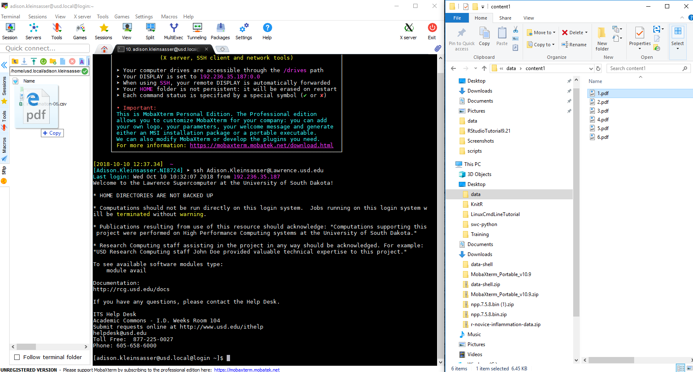
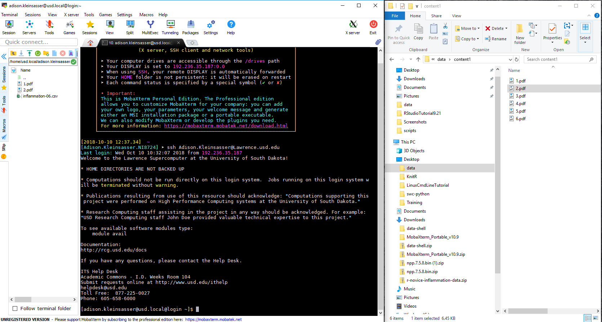
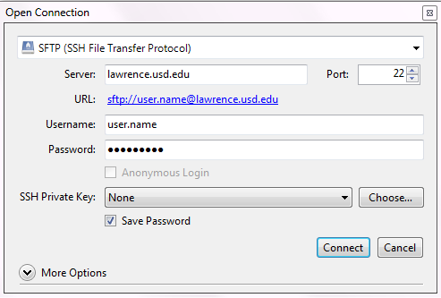
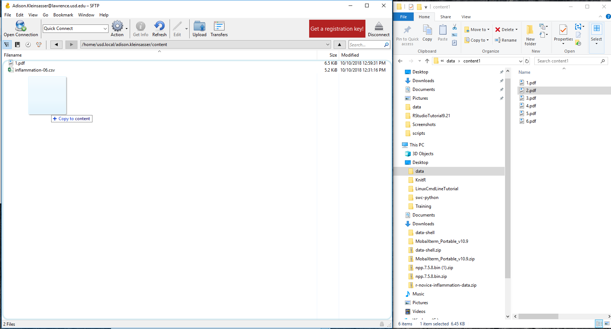
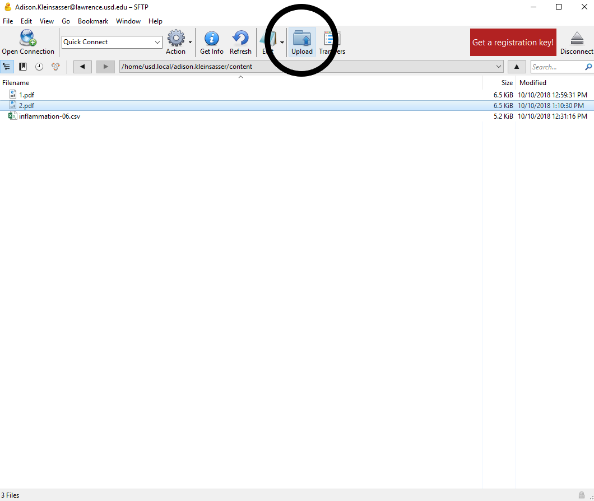
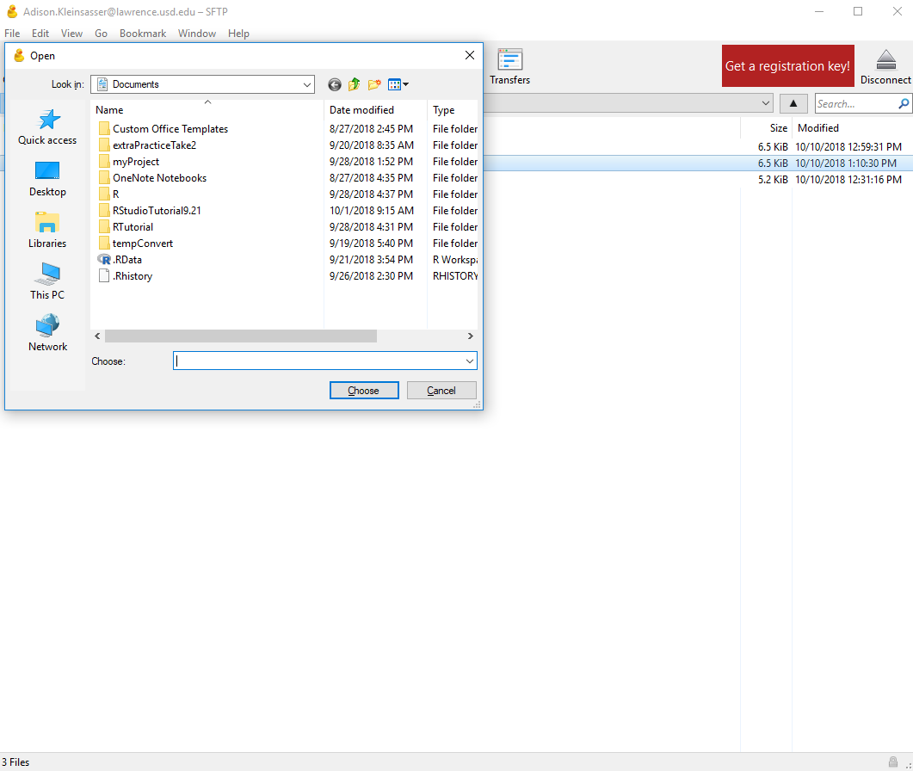
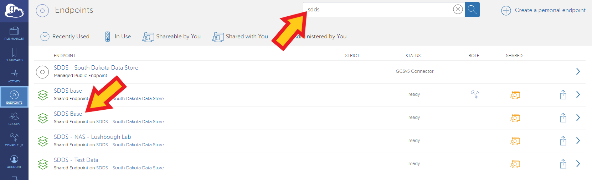

# Transferring Files

Transferring files onto and off of your Lawrence home directory can be done using several methods available to researchers at USD. This section will cover the movement of files between local systems and the Lawrence HPC.

### Drag-and-Drop Option

If you prefer to move files using the drag-and-drop method, it is possible using MobaXterm or Cyberduck. This file moving method uses sftp, or SSH \(or Secure\) File Transfer Protocol. For this we will open up MobaXterm or Cyberduck.

**MobaXterm**

In MobaXterm, the file explorer/hierarchy is visible just to the left of the command line interface.


From this section of the MobaXterm window, you can drag and drop files between either computer as you desire.





**Cyberduck**

Cyberduck can also be used for moving files by sftp in Windows and Mac, but not Linux. You can find the Cyberduck installation [here](https://cyberduck.io/). Once installed, opening Cyberduck should return a window as follows:


You will need to open a connection by clicking on the 'Open Connection' icon. This will return a window to fill in with the host information. Fill this window in as shown below \(note user.name will be your personal Lawrence username\). Be sure to choose SFTP and port 22:



After successfully connecting, you can upload files into your Lawrence folders on your home directory by dragging and dropping from your desktop... 



or by clicking the upload icon at the top of the Cyberduck display.





### SCP

The standard command line method for file movement between hosts is the `scp`command \(secure copy\). This is an ssh based protocol designed for moving files between local and remote hosts. To get files from your local computer, you will need to open a local terminal session on your computer \(Do not connect to the HPC! In this example, local@xyz is my local PC\).

```text
[local@xyz ~]$
```

The syntax of the `scp` command has four parts: 



Type the `scp` command as follows \(type the path you want your file transferred to on Lawrence; here I use ''some.folder'\):

```text
[local@xyz ~]$ scp file.name ./pathT o/file/file.name user.name@lawrence.usd.edu:/home/user.name/some.folder
user.name@lawrence.usd.edu's password: 
file.name              100% 8893     8.7KB/s   00:00
```


Hints:

* If an error such as "No such file or directory" appears, look in the directory at the new location to make sure it failed.  If it did, try adding usd.local after home \(user.name@lawrence.usd.edu:/home/usd.local/user.name/some.folder\)
* Don't forget the period \(.\) at the start of the initial path to the file: it refers to the current working directory \(the directory you are located in\).
* To transfer directories, add an -r flag

```text
[user.name@login@login some.folder]$ scp -r ./pathTo/directory/ user.name@lawrence.usd.edu:/home/user.name/

```

Open a second terminal and log in to Lawrence, then list directories.  The file file.name has been transferred.

```text
[user.name@login@login some.folder]$ ls
file.name
```

The last line in the first terminal gives stats on the transfer. You can also use scp for other data transfer applications including HPC to local PC, between HPCs, and between PCs. In a second terminal, where you are logged into Lawrence, you can check that the file was transferred and put into some.folder.

