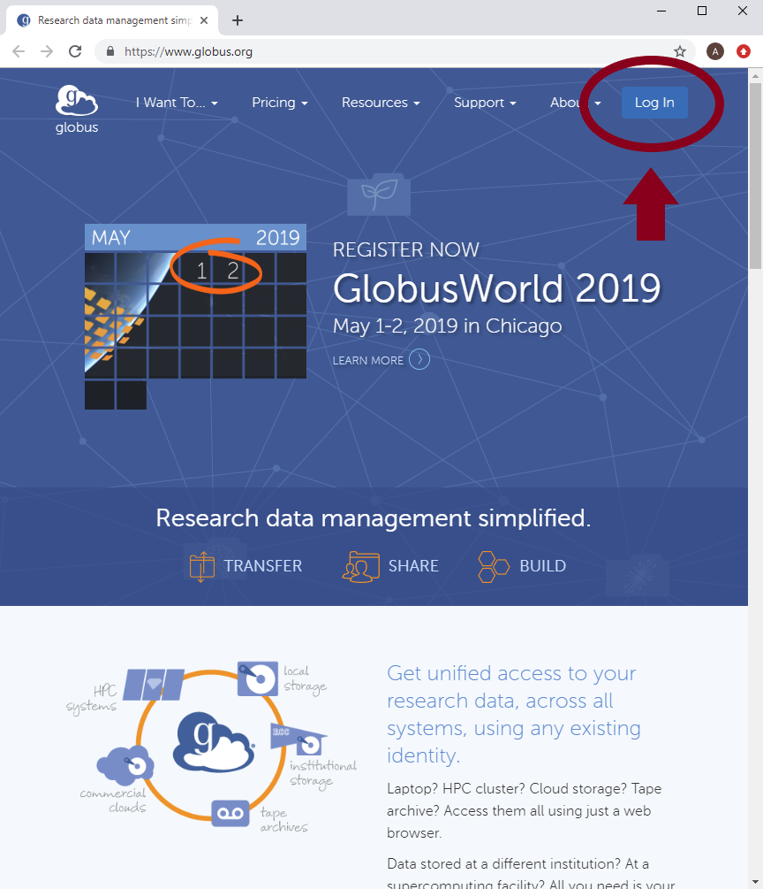

# .


This site is incomplete and under construction.  Proceed at your own risk.


## Getting Started

Navigate to the [Globus](https://www.globus.org/) website and click "Log In".

Select your organization \(University of South Dakota\) from the drop-down menu, then select Continue. 

Use your username and password to log in to USD’s CAS log in screen.

Globus will ask for permissions.

## Setting up Endpoints

## Transferring Files

