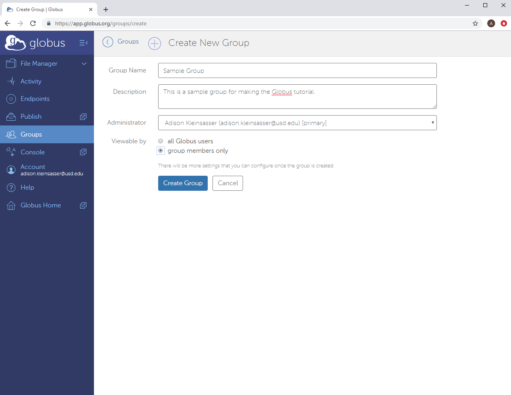

# .


This site is incomplete and under construction.  Proceed at your own risk.


## Getting Started

Navigate to the [Globus](https://www.globus.org/) website and click "Log In".

Select your organization \(e.g. University of South Dakota\) from the drop-down menu, then select Continue. 

Use your username and password to log in to USD’s CAS log in screen.

If this is your first time logging in, Globus may ask for permissions.

## Making a Non-USD Login

Go to the "Create a Globus ID" page, [here](https://www.globusid.org/create).  Fill out your information, and select "Create ID".

The page will change to a page which asks for a Globus ID verification code.  The email address you entered will receive an email containing this code.  

Enter this code in the window.

## Setting up Endpoints

## Transferring Files

## Making a Group

Open the options sidebar.

Click on "Groups".

Click on "Create new group".

Enter your group's information and click the "Create Group" button.

A success message will appear.

### Adding a Member to the Group

Click on the group name.

Click on "invite Others".

Type in the name of the group member to add and select from the dropdown menu.

Send the invitation.

## 

