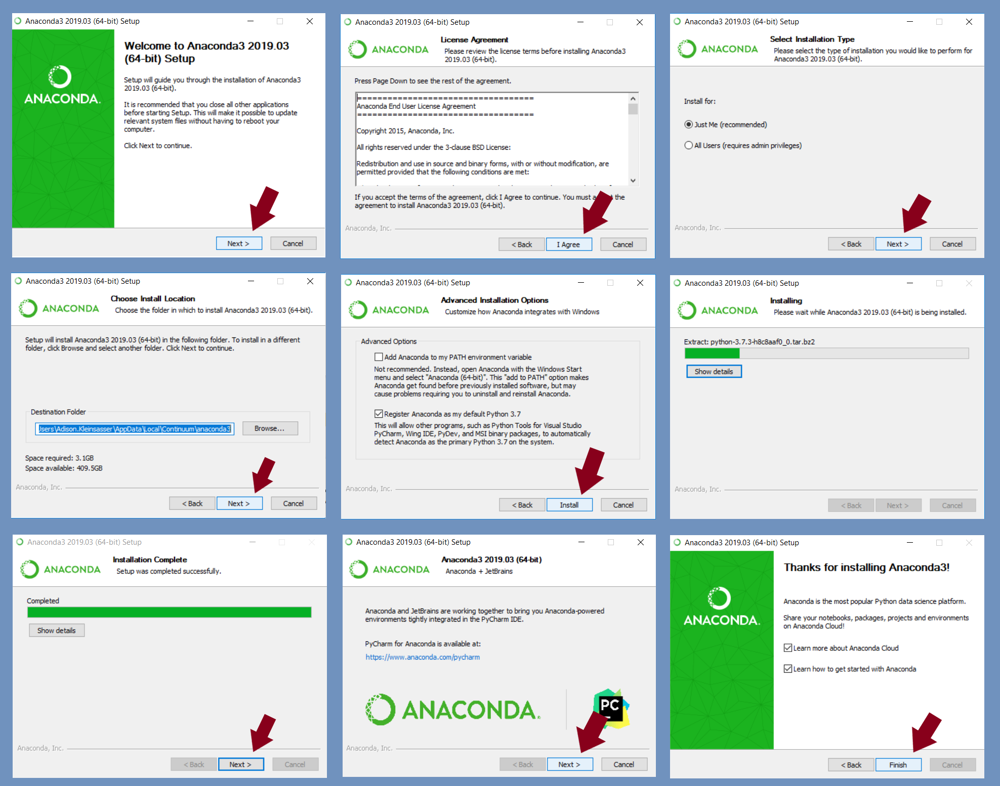
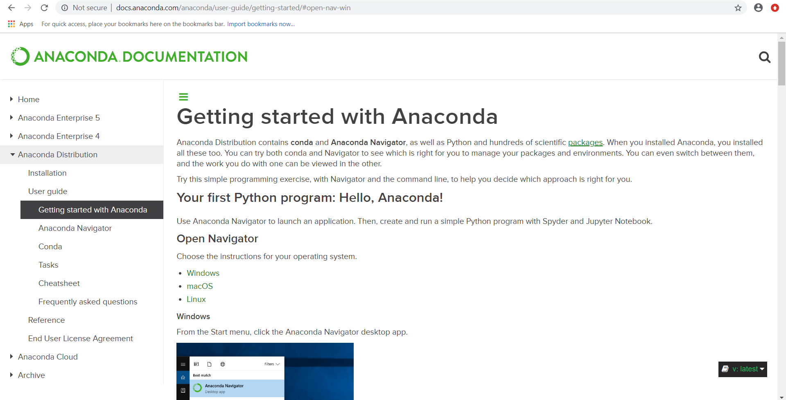
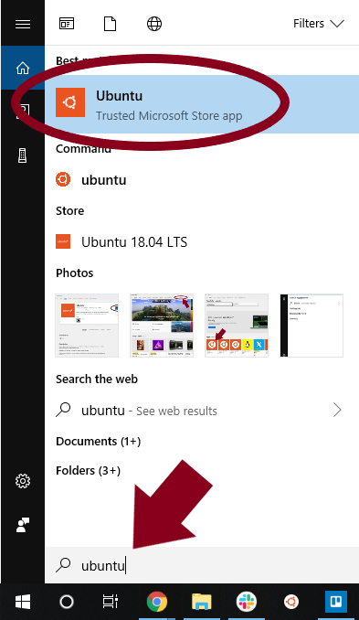
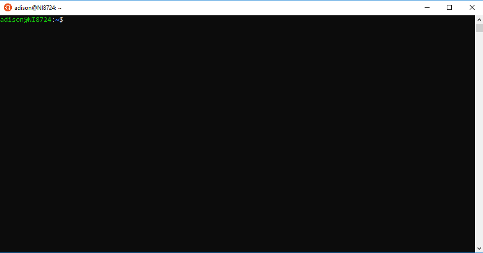

# Software Installations on Windows


Warning: this site is under construction.  The information may be incomplete.


## Anaconda on Windows

To download Anaconda, go to the distribution website: [https://www.anaconda.com/distribution/](https://www.anaconda.com/distribution/).


Scroll down to the download section.  Select "Windows", then select "Download".


Follow the installation wizard.



The Users Guide should pop up \([this](http://docs.anaconda.com/anaconda/user-guide/getting-started/#open-nav-win) webpage\).



To open Anaconda, go to the start menu and expand the Anaconda3 folder.


Select "Anaconda Navigator".


## Anaconda on Ubuntu on Windows

### Installing Ubuntu on Windows

Ubuntu for Windows can be downloaded from the Microsoft store.  


Search for "ubuntu".


Select the app.


Click "**Get**", then "**Install**".


Search for "Ubuntu" and select the app.



The window will look like this:




### Installing Anaconda on Ubuntu on Windows

First, open Ubuntu for Windows \(see above\) and check to ensure that conda is not already installed. 

```text
user@NI0000:~$ which conda
```

If it has been, a file path will show up under the command, if not, the next line will be a prompt.


Download the installer

```text
user@NI0000:~$ wget --quiet --no-check-certificate https://repo.continuum.io/miniconda/Miniconda3-latest-Linux-x86_64
.sh
user@NI0000:~$ ls
Miniconda3-latest-Linux-x86_64.sh

```

Run the installer

```text
user@NI0000:~$ bash Miniconda3-latest-Linux-x86_64.sh -b -p $HOME/anaconda3
```

```text
PREFIX=/home/adison/anaconda3
Unpacking payload ...
…
  zstd               pkgs/main/linux-64::zstd-1.3.7-h0b5b093_0
…
Preparing transaction: done
Executing transaction: done
installation finished.
…

user@NI0000:~$
```

Run an update:

```text
user@NI0000:~$ $HOME/anaconda3/bin/conda update conda -y
```

```text
Collecting package metadata (current_repodata.json): done
Solving environment: done
 ...

Executing transaction: done
user@NI0000:~$
```

Then install Anaconda

```text
user@NI0000:~$ $HOME/anaconda3/bin/conda install anaconda -y
```

```text
Collecting package metadata (current_repodata.json): done
Solving environment: done
 
## Package Plan ##
...
Verifying transaction: done
Executing transaction: / b'Enabling notebook extension jupyter-js-widgets/extension...\n      - Validating: \x1b[32mOK\x1b[0m\n'                                                                                                              done
user@NI0000:~$
```

Initialize

```text
user@NI0000:~$ $HOME/anaconda3/bin/conda init
```

```text
no change     /home/user/anaconda3/condabin/conda
...
no change     /home/user/anaconda3/etc/profile.d/conda.csh
modified      /home/user/.bashrc
 
==> For changes to take effect, close and re-open your current shell. <==
 
user@NI0000:~$
```

Close and re-open your Ubuntu command line.

## Bioconda on Windows on Ubuntu

After running the installation of Anaconda on Ubuntu on Windows \(see above\), add bioconda:

```text
user@NI0000:~$ conda config --add channels bioconda
```


