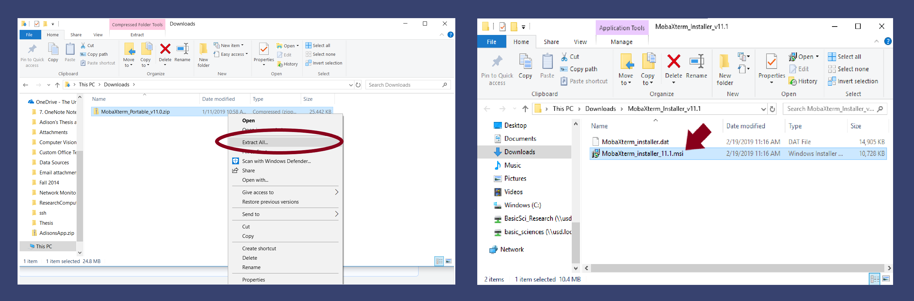

# Downloads

## MobaXterm \(MobaX\)

Go to the MobaXterm website [here](https://mobaxterm.mobatek.net/download-home-edition.html). Click on the "MobaXterm Home Edition v11.1 \(Home Installer Edition\)" button.  After it finishes downloading, click on the zip file button.


Extract the files, and double click on the installer.



Follow the setup wizard.  To open MobaX, go to the start search bar, and start typing "MobaXterm".

## XQuartz \(for Mac\)


If using a **USD issued computer**, you may need **administrative permissions**.  Please contact the ServiceDesk for assistance if these permissions prevent installation of the software.  Make sure to include details like the software name.

**Example:**  "I am following the tutorial instructions found at the RCG docs site \([https://usdrcg.gitbook.io/docs/non-lawrence-guides/downloads\#xquartz-for-mac](https://usdrcg.gitbook.io/docs/non-lawrence-guides/downloads#xquartz-for-mac)\) to download XQuartz.  My computer is USD issued, and requires administrative permissions to install the software.  Because I don't have this level of access, I would like help in installing this software."


To begin, first download the XQuartz installer [here](https://www.xquartz.org/).


Go to your downloads and open the installer.


Run the installer. \(If using a USD computer, an administrative username/password may be needed for this step.\)


## Cyberduck

Go to [https://cyberduck.io/download/](https://cyberduck.io/download/)

Select a download button, based on your computer's operating system. Click on the downloaded file.


Follow the installation wizard


Open Cyberduck using the search bar


## PuTTY

Go to [https://www.putty.org/](https://www.putty.org/)

Click the link "here" to go to the download page. 


Select the 32-bit installer link to download the PuTTY installer.  When the download is complete, click on the button in the bottom left corner of the browser to open the installer.


Install PuTTY with the installer


A README file will pop up.  You may ignore it for now while following this tutorial, but you may find the information useful when using PuTTY on your own.

Open a PuTTY window


## TigerVNC

To run VNC, you will need TigerVNC Viewer, available [here](https://bintray.com/tigervnc/stable/tigervnc).  Download the 64-bit version, shown below.


Click on the installed file, and follow the download wizard.

### Setting a VNC Password

Log in to Lawrence using MobaX or another terminal.

```text
[user.name@ ~]$ ssh User.Name@Lawrence.usd.edu
Warning: Permanently added 'lawrence.usd.edu' (RSA) to the list of known hosts.
User.Name@Lawrence.usd.edu's password:

Last login: Wed Jan  9 13:14:19 2019 from 192.236.35.187
Welcome to the Lawrence Supercomputer at the University of South Dakota!
......​

[user.name@usd.local@login ~]$
```

A VNC password needs to be set up \(this only needs to be done **once**\).  Make sure you use **vncpasswd**, **not** **vncpassword.**


Note: the password will not show up as you type


```text
[user.name@usd.local@login ~]$ vncpasswd
Password:
Verify:
```

It may ask "Would you like to enter a view-only password \(y/n\)?"  The usual response is "n".


