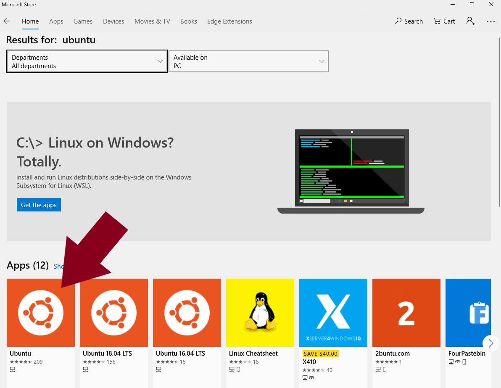
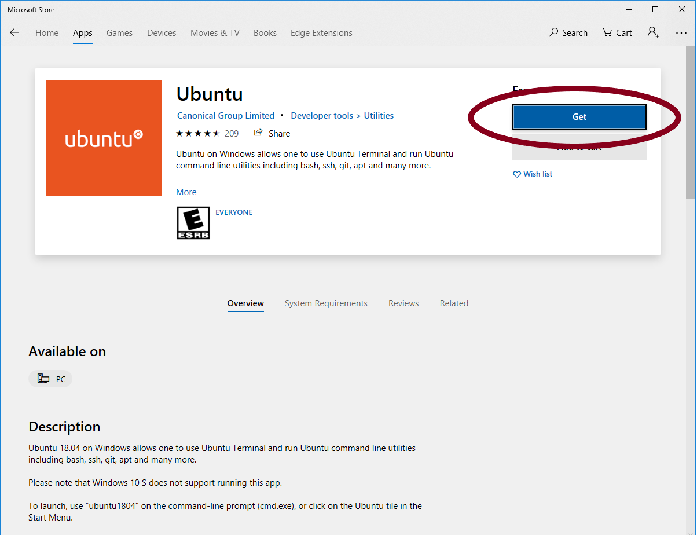

# Non-Lawrence Tutorials

## Ubuntu for Windows

Ubuntu for Windows is available on the Microsoft store.  To begin, search for the Microsoft Store in the search bar in Windows

Search for "ubuntu" in the search bar of the store.

Select the Ubuntu app.

Click "Get"

