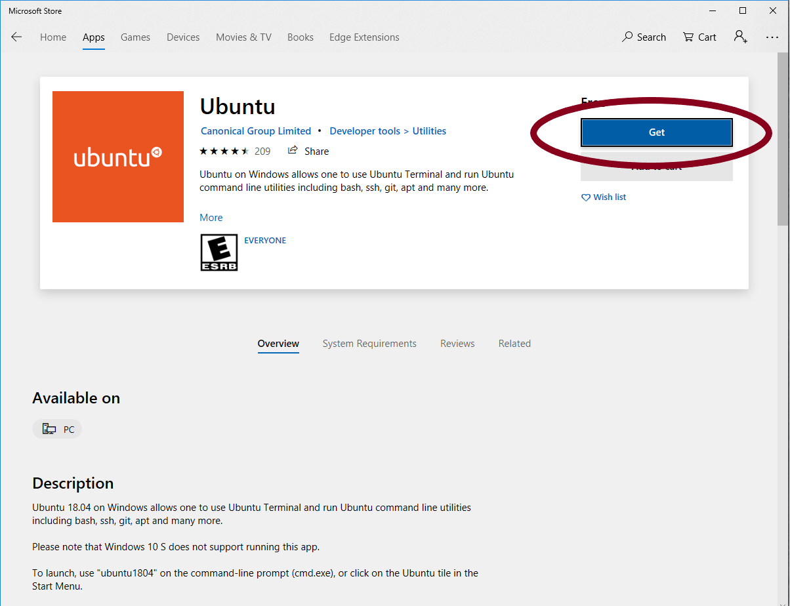
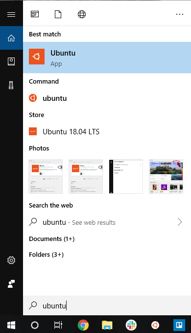

# Ubuntu- from Login page

### Using the Ubuntu terminal

Ubuntu for Windows is available on the Microsoft store.  To begin, search for the Microsoft Store in the search bar in Windows


Search for "ubuntu" in the search bar of the store.


Select the Ubuntu app.


Click "Get", then "Install".



#### Logging in

Open the Ubuntu terminal from Start



### Logging into Lawrence

With Ubuntu for Windows open, ssh into Lawrence.


* **USD users:** Lawrence login information will be based on your USD login \(e.g. your password will be the same as in your email account\)
* **Non-USD users**: receive an email from the ServiceDesk regarding login information and/or password creation after the account is set up.  



Note: your **password** will **not show up** as you type- it will look like nothing is happening.  It may seem strange, but keep typing, it is picking up the keystrokes.


```text
username@NI8724:~$ ssh -X User.Name@Lawrence.usd.edu
User.Name@lawrence.usd.edu's password:
```

If it accepts the password, it will show a welcome message and a prompt \(a line that ends with '$'\).

```text
Last login: Tue Aug 20 16:03:26 2019 from 192.236.54.40
Welcome to the Lawrence Supercomputer at the University of South Dakota!
### Other information.... ###
###                       ###
###                       ###
(base) [user.name@usd.local@login ~]$
```


