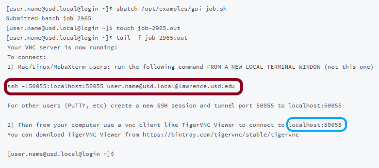

# VNC

## Graphical User Interface Jobs \(VNC\)

### First Time Set-up

To run VNC, you will need TigerVNC Viewer, available [here](https://bintray.com/tigervnc/stable/tigervnc).  Download the 64-bit version, shown below.


A VNC password also needs to be set up \(this only needs to be done once\). 


Note: the password will not show up as you type


```text
[user.name@usd.local@login ~]$ vncpasswd
Password:
Verify:
```

### **Starting the GUI**  

The example below demonstrates how to start a VNC session on a general purpose compute node:

#### Command Line \#1:



Note: the numbers in job-2965.out **correspond** to the number of the **batch job** in the second line \(the number in your command line will likely be different\).


The tail -f command will print the last few lines of the file, which looks like this:

#### Command Line \#1:



Copy the ssh command \(it will look like the command **circled in red above**\) and **paste** it into a **different command line** \(then press "enter"\).  It will then ask for a password. \(This is the password you would use to log in to Lawrence, **not the vnc password**.\)  The password will **not appear** as it is typed in.

#### Command Line \#2:


#### VNC Viewer

Open TigerVNC, copy the localhost \(it will look like what is circled in blue in command line \#1\), and paste it into the "NVC Viewer: Connection Details" window.  Click "Connect".


The window will then ask for a password. Type in the **VNC password** you made earlier.


Your VNC window will then pop up.


When you are finished, **log out** of the VNC by **closing the black terminal**.  A job that is not closed will continue to run and use node space \(even if you close the window\), until it times out.


### Opening Programs in the GUI \(e.g. RStudio\)

Make sure the package\(s\) needed are installed.  For this example, I will use RStudio.  To install RStudio, I use "conda install rstudio"

```text
[user.name@usd.local@node01 ~]$ conda install rstudio
Solving environment: done

## Package Plan ##

  environment location: /home/usd.local/user.name/anaconda3
........
Preparing transaction: done
Verifying transaction: done
Executing transaction: done
[user.name@usd.local@node01 ~]$
```

To run RStudio, type "rstudio" \(all **lowercase**\) in the TigerVNC command line.

```text
[user.name@usd.local@node01 ~]$ rstudio
load glyph failed err=6 face=0x555cb51b7a30, glyph=2793
load glyph failed err=6 face=0x555cb51b7a30, glyph=2793
^C
[user.name@usd.local@node01 ~]$ 
```

An RStudio window will then pop up within the TigerVNC window. 


You may now use the RStudio in VNC the same way you would use RStudio on the desktop.  To open a file, go to File/open in the RStudio window. This will open the Lawrence local directories, not the directories on the desktop/laptop being used.


### GUI Partitions

#### HiMem

To request a VNC session on the HiMem node, use the same commands as given under General Compute excepting the following command with sbatch:

```text
[user.name@usd.local@login ~]$ sbatch -p himem /opt/examples/gui-job.sh
```

#### GPU

To request a VNC session on the HiMem node, use the same commands as given under General Compute excepting the following command with sbatch:

```text
[user.name@usd.local@login ~]$ sbatch --gres=gpu:pascal:1 -p gpu /opt/examples/gui-job.sh
```

#### Viz

The Lawrence viz node is designed for users who wish to do advanced visualization. The viz node gives users access to accelerated 3D graphics \(one node with one GPU having a GTX logic unit\). A typical use case for the viz node is a virtual network computing \(VNC\) job coupled with a real-time graphical user interface \(GUI\). Please note that a graphical job can be run on any node on the cluster and is not solely limited to the viz node \(although the viz node will often have the best performance\).

Viz nodes must be specifically requested using the “--gres” parameter. Viz access is controlled by cgroups, which means the resource must be requested if it is to be used. This prevents use conflicts. The format for requesting the GPU node \(as specified in the contig file\) is TYPE:LABEL:NUMBER.

TYPE will be “vis”.

LABEL is defined as “gtx” for the viz node.

NUMBER is the amount of resources requested. For the Vis node the only option is “1” as there is only one.

To request a VNC session on the HiMem node, use the same commands as given under General Compute excepting the following command with sbatch:

```text
[user.name@usd.local@login ~]$ sbatch --gres=gpu:gtx -p viz /opt/examples/gui-job.sh
```

