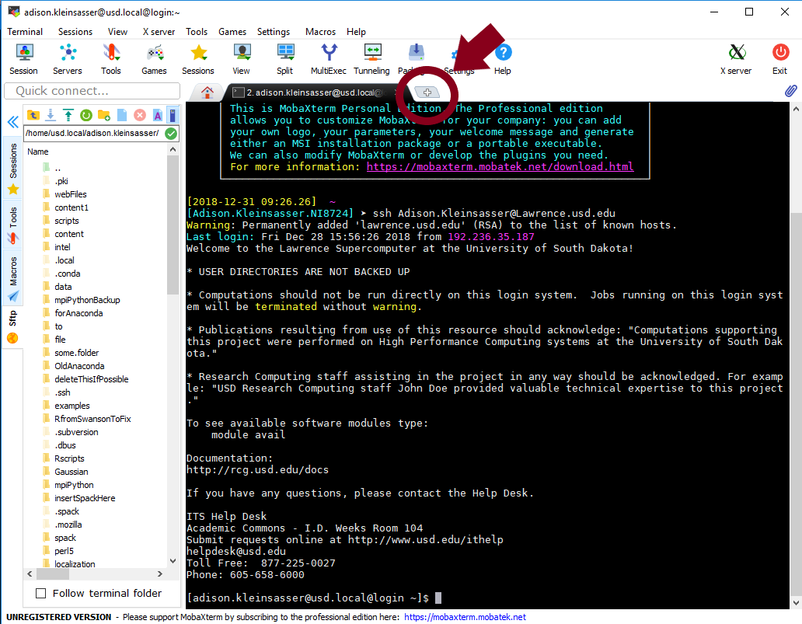
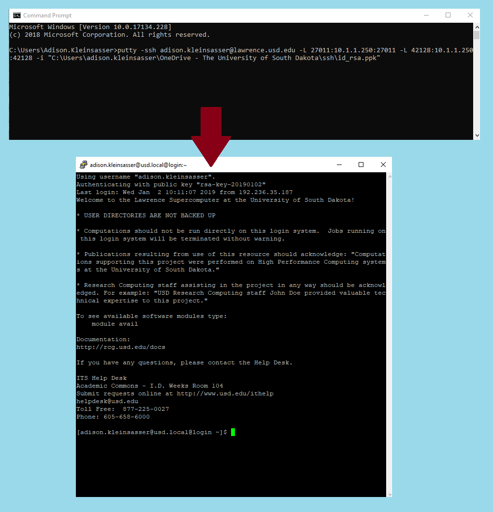

# Under Construction


See the "Lumerical \(FDTD\) on Windows" section "[Disable any local node-locked license on your PC](https://usdrcg.gitbook.io/docs/~/edit/drafts/-LUGvCyCLVx1LFQp3u6h/software-and-apps/lumerical-fdtd-on-windows-pc#disable-any-local-node-locked-license-on-your-pc)" before continuing.


## Install TigerVNC

Go to the TigerVNC website [here](https://github.com/TigerVNC/tigervnc/releases). Click on the first source code link:


Go to your downloads folder, right-click on "tigervnc-1.9.0.zip", and select "Extract All..."  A new window will appear.  \(If desired, choose a new location for the extracted contents.\) Select the "Extract" button.


## Opening Lumerical on Lawrence


You must **set up a tunnel** to the Lumerical license on Lawrence before starting this tutorial.

* If this is your **first time** doing this on your **current** computer \(or you've **reactivated** the license on your PC\), click [here](https://usdrcg.gitbook.io/docs/~/edit/drafts/-LUGvCyCLVx1LFQp3u6h/software-and-apps/lumerical-fdtd-on-windows-pc).
* If you've **done this before** on your computer \(and haven't reactivated the license on your PC\), click [here](https://usdrcg.gitbook.io/docs/~/edit/drafts/-LUGvCyCLVx1LFQp3u6h/software-and-apps/lumerical-fdtd-on-windows-pc#create-a-putty-session-to-tunnel-lumerical-from-lawrence).



If you haven't made a VNC password yet, do this now:

```text
[user.name@usd.local@login ~]$ vncpasswd
Password:
Verify:
```


Note: the password will not show when typing.


Export a path for Lumerical:

```text
[user.name@usd.local@login ~]$ export PATH=/apps/lumerical/bin:$PATH
```

### Opening a VNC

In MobaX, open a second terminal by clicking the "+" tab.  This will will be used in a moment.



#### Terminal \#1:



Note: the numbers in job-2965.out **correspond** to the number of the **batch job** in the second line \(the number in your command line will likely be different\).


The tail -f command will print the last few lines of the file, which looks like this:

#### Terminal \#1:


Copy the ssh command \(it will look like the command **circled in red above**\) and **paste** it into the **second terminal** \(then press "enter"\).  It will then ask for a password. \(This is the password you would use to log in to Lawrence, **not the vnc password**.\)  The password will **not appear** as it is typed in.

#### Terminal \#2:


#### VNC Viewer

Open TigerVNC, copy the localhost \(it will look like what is circled in blue in command line \#1\), and paste it into the "NVC Viewer: Connection Details" window.  Click "Connect".


The window will then ask for a password. Type in the **VNC password** you made earlier.


Your VNC window will then pop up.


### Opening Lumerical

  Open a Windows command line


Connect to the Lawrence license, replacing "user.name" with your username on Lawrence and "path\to\ID\_RASfile\" with the path to your file.

```text
C:\Users\user>putty -ssh user.name@lawrence.usd.edu -L 27011:10.1.1.250:27011 -L 42128:10.1.1.250:42128 -i "C:\Users\user\path\to\ID_RASfile\id_rsa.ppk"
```

A new window will appear. It may ask for a password to log into Lawrence.




You may now open the Lumerical software on your desktop.

