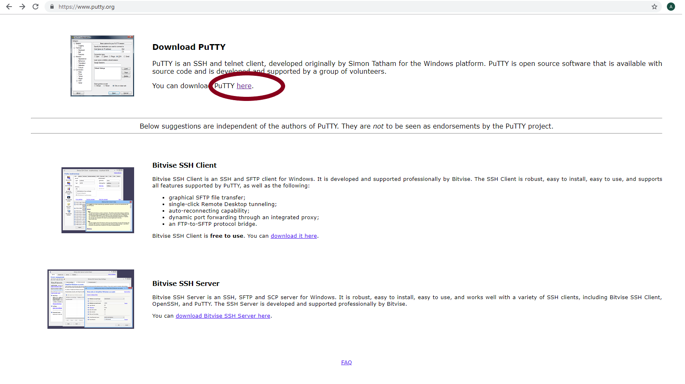
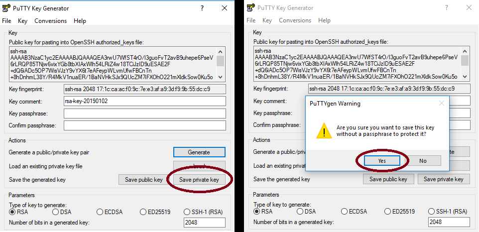
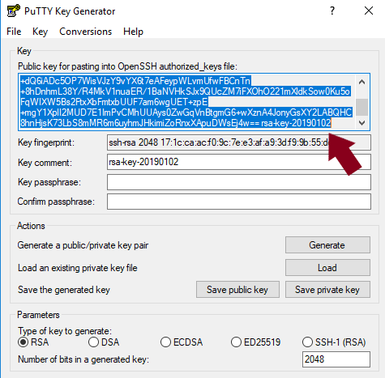
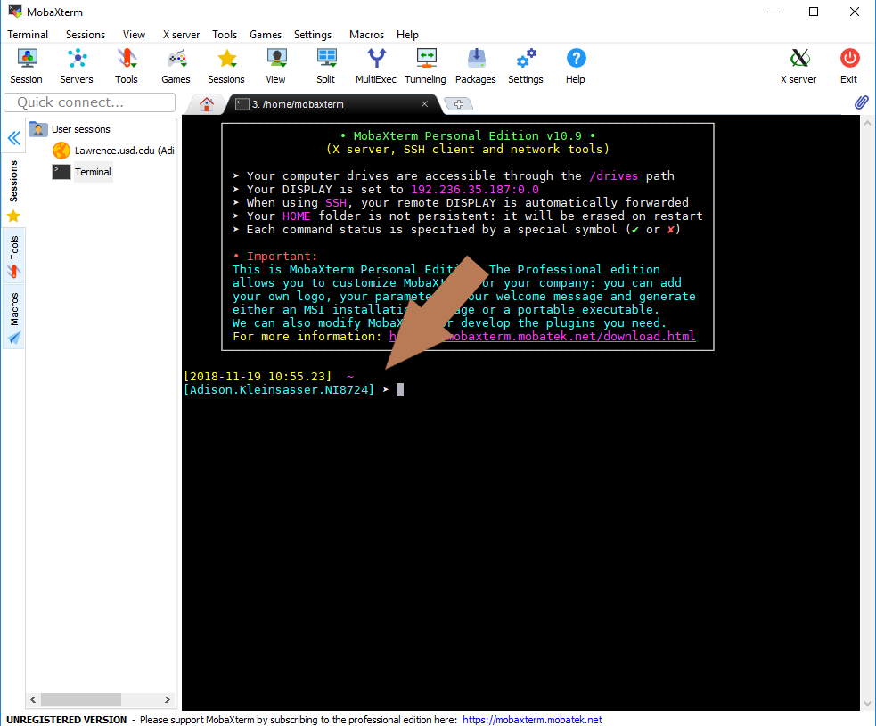
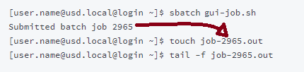
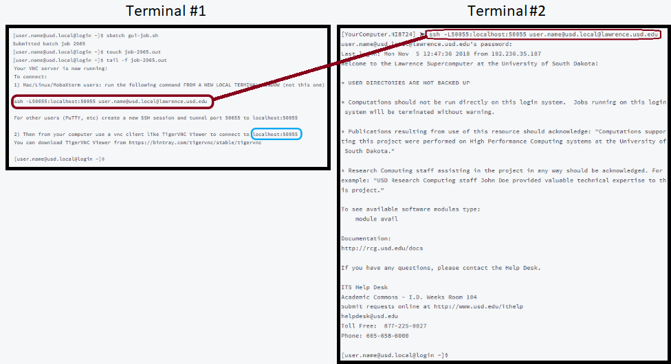

# .


This site is incomplete and currently under construction. It may have missing or erroneous steps or details. 

It also does not meet non-flammability standards and is known to cause cancer in the state of California.


This is a step-by-step guide for running Lumerical on a graphical user interface \(GUI\) on Lawrence. 


If you have **done this before** on the computer ****you are **currently using,** and **haven't \(re\)activated** a Lumerical licence on it since, you may **skip to** the section "Opening Lumerical on Lawrence".


## Disable any local node-locked license on your PC

Open the "Configure FDTD License" app on your PC


Click on the "Node Locked" tab, then the "Licenses" subtab.  Highlight your license, and select "Deactivate". Note that your license will likely have a **limit** on the number of times you may deactivate and reactivate it.  Click "Yes", then "Ok".


### 

## **Install MobaXterm**

Go to the MobaXterm website [here](https://mobaxterm.mobatek.net/download-home-edition.html). Click on the "MobaXterm Home Edition v11.1 \(Home Installer Edition\)" button.


## Install PuTTY

Go to [https://www.putty.org/](https://www.putty.org/)

Click the link "here" to go to the download page. 



Select the 32-bit installer link to download the PuTTY installer.  When the download is complete, click on the button in the bottom left corner of the browser to open the installer.


Install PuTTy with the installer


A README file will pop up.  You may ignore it for now while following this tutorial, but you may find the information useful when using PuTTY on your own.

Open a PuTTY window


## Install TigerVNC

Go to the TigerVNC website [here](https://github.com/TigerVNC/tigervnc/releases). Click on the first source code link:


Go to your downloads folder, right-click on "tigervnc-1.9.0.zip", and select "Extract All..."  A new window will appear.  \(If desired, choose a new location for the extracted contents.\) Select the "Extract" button.


## First Time Set-up

### Make Private & Public Keys

Open PuTTYgen.


Select "Generate", then wave your mouse around in a haphazard fashion.


Save the private key.  \(If asked whether you are sure about saving without passphrase protection, click "yes".  **Remember** where you save it.  **Save** the key as **id\_rsa.ppk**.



**Copy** the public key \(make sure you get **all of it**-there will likely be **more lines than fit in the text area** at once\).



### Add Key to Authorized Keys

Open MobaX and start a local terminal.


The command line prompt will appear:



You can then ****ssh onto the Lawrence cluster. You will be prompted for a password, which is your USD credentials. As a security feature, three incorrect logins will result in your account being locked until the lockout expires or an administrator overrides it.

```text
[2018-11-19 10:55.23]  ~
[User.Name.NI11018] ➤ ssh User.Name@Lawrence.usd.edu
User.Name@lawrence.usd.edu's password:
Last login: Mon Dec 25 19:37:34 2017 from ni11018.usd.local
[user.name@usd.local@login ~]$
```


Note: the password will not show when typing.


 Then open your authorized\_keys file

```text
[user.name@usd.local@login ~]$ cd
[user.name@usd.local@login ~]$ cd .ssh/
[user.name@usd.local@login .ssh]$ nano authorized_keys
```

A text editor \(nano\) will open, showing your keys. Press your **down-arrow key** once to go to the next line. **Paste** \(right click, select paste\) your **public key** into the file.  \(Ctrl-v won't work in MobaX for pasting.\)

Click **Ctrl-o**, then **Enter** to save, and then **Ctrl-x** to exit.



If the pasted line looks **shorter than the other line\(s\)**, but you are **certain you copied all of the public key**, don't worry- use the left arrow key to move past the left end of the pasted line, and the line will scroll, showing the rest of it.


## Opening Lumerical on Lawrence


You must **set up a tunnel** to the Lumerical license on Lawrence before starting this tutorial.

* If this is your **first time** doing this on your **current** computer \(or you've **reactivated** the license on your PC\), click [here](https://usdrcg.gitbook.io/docs/~/edit/drafts/-LUGvCyCLVx1LFQp3u6h/software-and-apps/lumerical-fdtd-on-windows-pc).
* If you've **done this before** on your computer \(and haven't reactivated the license on your PC\), click [here](https://usdrcg.gitbook.io/docs/~/edit/drafts/-LUGvCyCLVx1LFQp3u6h/software-and-apps/lumerical-fdtd-on-windows-pc#create-a-putty-session-to-tunnel-lumerical-from-lawrence).



If you haven't made a VNC password yet, do this now:

```text
[user.name@usd.local@login ~]$ vncpasswd
Password:
Verify:
```


Note: the password will not show when typing.


Export a path for Lumerical:

```text
[user.name@usd.local@login ~]$ export PATH=/apps/lumerical/bin:$PATH
```

### Opening a VNC

In MobaX, open a second terminal by clicking the "+" tab.  This will will be used in a moment.


#### Terminal \#1:




Note: the numbers in job-2965.out **correspond** to the number of the **batch job** in the second line \(the number in your command line will likely be different\).


The tail -f command will print the last few lines of the file, which looks like this:

#### Terminal \#1:


Copy the ssh command \(it will look like the command **circled in red above**\) and **paste** it into the **second terminal** \(then press "enter"\).  It will then ask for a password. \(This is the password you would use to log in to Lawrence, **not the vnc password**.\)  The password will **not appear** as it is typed in.

#### Terminal \#2:



#### VNC Viewer

Open TigerVNC, copy the localhost \(it will look like what is circled in blue in command line \#1\), and paste it into the "NVC Viewer: Connection Details" window.  Click "Connect".


The window will then ask for a password. Type in the **VNC password** you made earlier.


Your VNC window will then pop up.


### 

