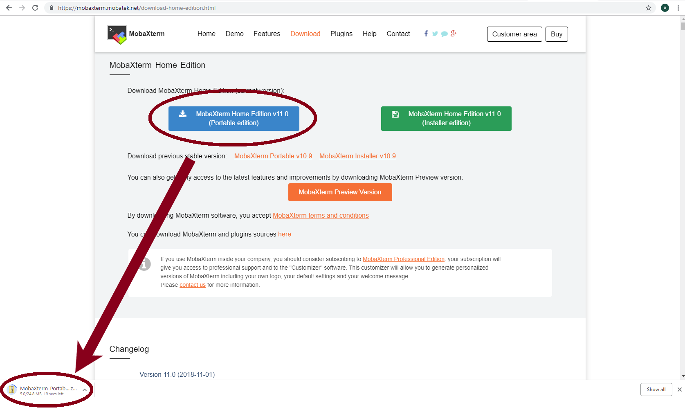
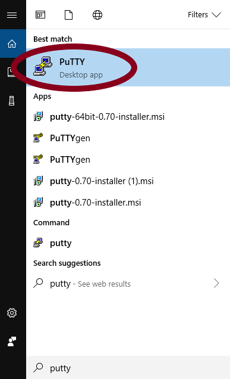
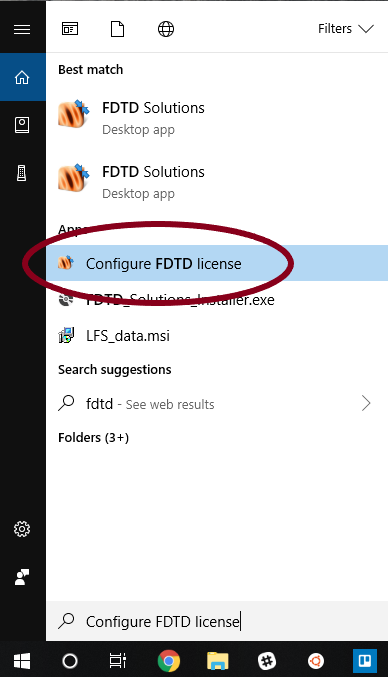
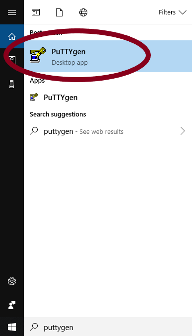
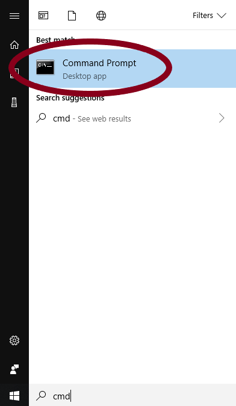
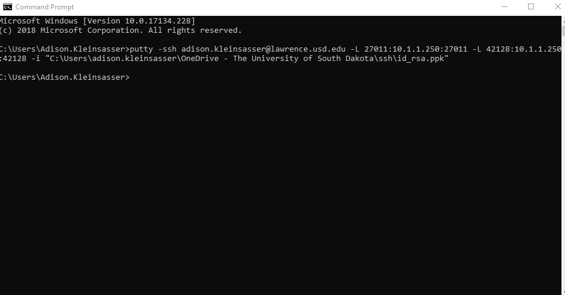
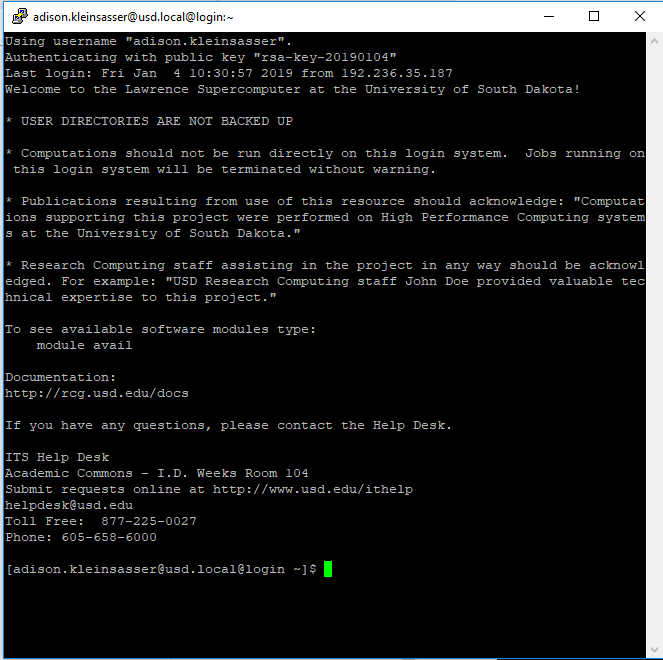

# .



This site is incomplete and currently under construction. It may have missing or erroneous steps or details.  

It also does not meet non-flammability standards and is known to cause cancer in the state of California.


This is a step-by-step guide for running Lumerical on Windows using the license available for Lawrence. This tutorial is a **prerequisite** for the tutorial on running **Lumerical in a GUI on Lawrence**.

## **Install MobaXterm**

Go to the MobaXterm website [here](https://mobaxterm.mobatek.net/download-home-edition.html). Click on the "MobaXterm Home Edition v11.0 \(Portable edition\)" button.



Go to your downloads folder, and extract the files from the zipped folder you just downloaded.  \(If desired, choose a new location for the extracted contents.\)


## Install PuTTY


If you already have PuTTY installed in your computer, you may ignore this section. \(Click [here](https://usdrcg.gitbook.io/docs/~/edit/drafts/-LUGvCyCLVx1LFQp3u6h/software-and-apps/lumerical-fdtd-on-windows-pc#create-a-putty-session-to-tunnel-lumerical-from-lawrence).\)


Go to [https://www.putty.org/](https://www.putty.org/)

Click the link "here" to go to the download page. 


Select the 32-bit installer link to download the PuTTY installer.  When the download is complete, click on the button in the bottom left corner of the browser to open the installer.


Install PuTTy with the installer


A README file will pop up.  You may ignore it for now while following this tutorial, but you may find the information useful when using PuTTY on your own.

Open a PuTTY window



## First Time Set-up

### Disable any local node-locked license on your PC

Open the "Configure FDTD License" app on your PC



Click on the "Node Locked" tab, then the "Licenses" subtab.  Highlight your license, and select "Deactivate". Note that your license will likely have a **limit** on the number of times you may deactivate and reactivate it.  Click "Yes", then "Ok".


### Make Private & Public Keys

Open PuTTygen



Select "Generate", then wave your mouse around in a haphazard fashion.


Save the private key.  \(If asked whether you are sure about saving without passphrase protection, click "yes".  **Remember** where you save it.  **Save** the key as **id\_rsa.ppk**.


**Copy** the public key \(make sure you get **all of it**-there will likely be **more lines than fit in the text area** at once\).


### Add Key to Authorized Keys

Open MobaX and start a local terminal.


The command line prompt will appear:


You can then ****ssh onto the Lawrence cluster. You will be prompted for a password, which is your USD credentials. As a security feature, three incorrect logins will result in your account being locked until the lockout expires or an administrator overrides it.

```text
[2018-11-19 10:55.23]  ~
[User.Name.NI11018] ➤ ssh User.Name@Lawrence.usd.edu
User.Name@lawrence.usd.edu's password:
Last login: Mon Dec 25 19:37:34 2017 from ni11018.usd.local
[user.name@usd.local@login ~]$
```


Note: the password will not show when typing.


 Then open your authorized\_keys file

```text
[user.name@usd.local@login ~]$ cd
[user.name@usd.local@login ~]$ cd .ssh/
[user.name@usd.local@login .ssh]$ nano authorized_keys
```

A text editor \(nano\) will open, showing your keys. Press your **down-arrow key** once to go to the next line. **Paste** \(right click, select paste\) your **public key** into the file.  \(Ctrl-v won't work in MobaX for pasting.\)

Click **Ctrl-o**, then **Enter** to save, and then **Ctrl-x** to exit.


## Open a PuTTy session to tunnel Lumerical from Lawrence

Open a Windows Command Line



Open a tunnel, replacing user.name with your USD username, and path\to\your\file with the path to the id\_rsa.ppk file:

```text
C:\Users\User.name>putty -ssh user.name@lawrence.usd.edu -L 27011:10.1.1.250:27011 -L 42128:10.1.1.250:42128 -i "C:\Users\user.name\path\to\your\file\id_rsa.ppk"
```



Another window will pop up



It may ask for your password.


Note: your password will not appear as you type -- nothing will -- just keep typing as if it did.



